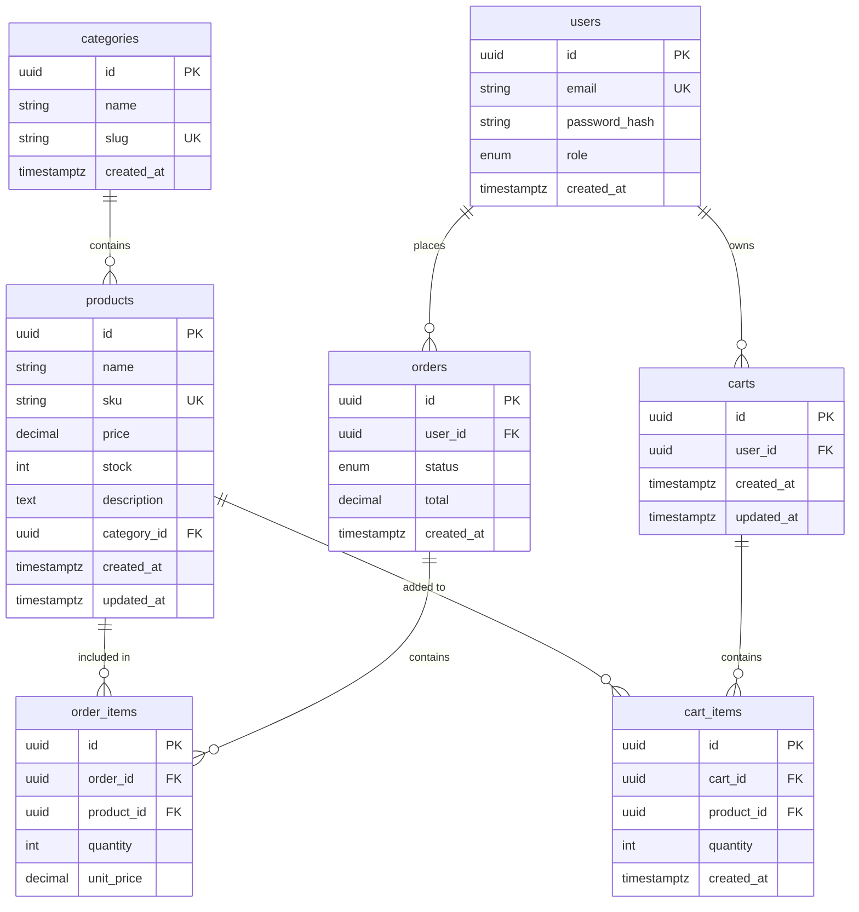

# Database-Specific Copilot Instructions

**Context:** Working in `database/` folder (SQL migrations, seeds, ERD)

---

## Core Principle

**The `database/` folder is the source of truth.**

All schema changes start here as hand-written SQL, then are optionally wrapped in TypeORM migration files for local dev consistency.

---

## Workflow

1. **Write SQL migration** in `migrations/YYYYMMDD_description.sql`
2. **Apply to Supabase** via SQL editor or CLI
3. **Create TypeORM wrapper** (optional, for local dev)
4. **Update ERD** if schema structure changes

---

## SQL Migration Pattern

### File naming: `YYYYMMDD_description.sql`

Example: `20260303_add_products_table.sql`

```sql
-- ============================================================
-- Migration: Add products table
-- Date: 2026-03-03
-- Author: [Your Name]
-- Description: Creates products table with category relationship
-- ============================================================

-- Create products table
CREATE TABLE products (
  id UUID PRIMARY KEY DEFAULT gen_random_uuid(),
  name VARCHAR(255) NOT NULL,
  sku VARCHAR(100) UNIQUE NOT NULL,
  price DECIMAL(10, 2) NOT NULL CHECK (price > 0),
  stock INT NOT NULL DEFAULT 0 CHECK (stock >= 0),
  description TEXT,
  image_url VARCHAR(500),
  category_id UUID NOT NULL,
  created_at TIMESTAMPTZ DEFAULT NOW(),
  updated_at TIMESTAMPTZ DEFAULT NOW()
);

-- Create indexes
CREATE INDEX idx_products_category_id ON products(category_id);
CREATE INDEX idx_products_sku ON products(sku);
CREATE INDEX idx_products_created_at ON products(created_at DESC);

-- Add foreign key constraint
ALTER TABLE products
  ADD CONSTRAINT fk_products_category
  FOREIGN KEY (category_id)
  REFERENCES categories(id)
  ON DELETE RESTRICT
  ON UPDATE CASCADE;

-- Add trigger for updated_at
CREATE OR REPLACE FUNCTION update_updated_at_column()
RETURNS TRIGGER AS $$
BEGIN
  NEW.updated_at = NOW();
  RETURN NEW;
END;
$$ LANGUAGE plpgsql;

CREATE TRIGGER trigger_products_updated_at
  BEFORE UPDATE ON products
  FOR EACH ROW
  EXECUTE FUNCTION update_updated_at_column();

-- Add comments
COMMENT ON TABLE products IS 'Product catalog for PC parts store';
COMMENT ON COLUMN products.sku IS 'Stock Keeping Unit - unique product identifier';
COMMENT ON COLUMN products.price IS 'Price in USD';
```

### Rollback file: `20260303_add_products_table_down.sql`

```sql
-- ============================================================
-- Rollback: Add products table
-- Date: 2026-03-03
-- ============================================================

DROP TRIGGER IF EXISTS trigger_products_updated_at ON products;
DROP FUNCTION IF EXISTS update_updated_at_column();
DROP TABLE IF EXISTS products CASCADE;
```

---

## Best Practices

### 1. **Use Constraints**
```sql
-- Primary key
id UUID PRIMARY KEY DEFAULT gen_random_uuid()

-- Unique constraint
sku VARCHAR(100) UNIQUE NOT NULL

-- Check constraint
price DECIMAL(10, 2) NOT NULL CHECK (price > 0)
stock INT CHECK (stock >= 0)

-- Foreign key with cascade rules
FOREIGN KEY (category_id) REFERENCES categories(id)
  ON DELETE RESTRICT   -- Prevent deletion if referenced
  ON UPDATE CASCADE    -- Update related rows if parent changes
```

### 2. **Index Strategy**
```sql
-- Primary key (automatic)
-- Foreign keys (for joins)
CREATE INDEX idx_products_category_id ON products(category_id);

-- Unique fields used in WHERE clauses
CREATE INDEX idx_products_sku ON products(sku);

-- Frequently sorted/filtered columns
CREATE INDEX idx_products_created_at ON products(created_at DESC);

-- Composite indexes for common queries
CREATE INDEX idx_orders_user_status ON orders(user_id, status);
```

### 3. **Timestamps Pattern**
```sql
-- Add to every table
created_at TIMESTAMPTZ DEFAULT NOW(),
updated_at TIMESTAMPTZ DEFAULT NOW()

-- Auto-update trigger (create once, reuse)
CREATE TRIGGER trigger_TABLE_NAME_updated_at
  BEFORE UPDATE ON TABLE_NAME
  FOR EACH ROW
  EXECUTE FUNCTION update_updated_at_column();
```

### 4. **Naming Conventions**
```sql
-- Tables: plural, snake_case
products, order_items, cart_items

-- Columns: snake_case
user_id, created_at, image_url

-- Indexes: idx_table_column(s)
idx_products_category_id
idx_orders_user_status

-- Foreign keys: fk_child_parent
fk_products_category
fk_order_items_order

-- Triggers: trigger_table_action
trigger_products_updated_at

-- Constraints: chk_table_condition
chk_products_price_positive
```

---

## Common Table Patterns

### UUID Primary Keys
```sql
id UUID PRIMARY KEY DEFAULT gen_random_uuid()
```

### Enum Types
```sql
-- Create enum
CREATE TYPE order_status AS ENUM (
  'pending',
  'processing',
  'shipped',
  'delivered',
  'cancelled'
);

-- Use in table
CREATE TABLE orders (
  id UUID PRIMARY KEY DEFAULT gen_random_uuid(),
  status order_status NOT NULL DEFAULT 'pending'
);
```

### JSONB for Flexible Data
```sql
-- Product specifications (variable structure)
specs JSONB,

-- Add GIN index for JSONB queries
CREATE INDEX idx_products_specs ON products USING GIN (specs);
```

### Many-to-Many Relationship
```sql
-- Junction table
CREATE TABLE order_items (
  id UUID PRIMARY KEY DEFAULT gen_random_uuid(),
  order_id UUID NOT NULL,
  product_id UUID NOT NULL,
  quantity INT NOT NULL CHECK (quantity > 0),
  unit_price DECIMAL(10, 2) NOT NULL,
  
  FOREIGN KEY (order_id) REFERENCES orders(id) ON DELETE CASCADE,
  FOREIGN KEY (product_id) REFERENCES products(id) ON DELETE RESTRICT,
  
  -- Prevent duplicate products in same order
  UNIQUE (order_id, product_id)
);
```

### Soft Deletes (Optional)
```sql
deleted_at TIMESTAMPTZ NULL,

-- Query pattern: WHERE deleted_at IS NULL
```

---

## Seed Data Pattern

### File: `seeds/01_categories.sql`

```sql
-- ============================================================
-- Seed: Product categories
-- ============================================================

INSERT INTO categories (id, name, slug) VALUES
  ('550e8400-e29b-41d4-a716-446655440001', 'CPU', 'cpu'),
  ('550e8400-e29b-41d4-a716-446655440002', 'GPU', 'gpu'),
  ('550e8400-e29b-41d4-a716-446655440003', 'RAM', 'ram'),
  ('550e8400-e29b-41d4-a716-446655440004', 'Storage', 'storage')
ON CONFLICT (id) DO NOTHING;
```

**Key points:**
- Use fixed UUIDs for seed data (for foreign key references)
- Use `ON CONFLICT DO NOTHING` for idempotency
- Number files for execution order (`01_`, `02_`, etc.)

---

## TypeORM Wrapper (Optional)

Create after SQL migration is applied to Supabase:

```typescript
// api/migrations/20260303_add_products_table.ts
import { MigrationInterface, QueryRunner } from "typeorm";

export class AddProductsTable1709431234567 implements MigrationInterface {
  name = 'AddProductsTable1709431234567'

  public async up(queryRunner: QueryRunner): Promise<void> {
    // Paste the same SQL from database/migrations/20260303_add_products_table.sql
    await queryRunner.query(`
      CREATE TABLE products (
        id UUID PRIMARY KEY DEFAULT gen_random_uuid(),
        name VARCHAR(255) NOT NULL,
        sku VARCHAR(100) UNIQUE NOT NULL,
        price DECIMAL(10, 2) NOT NULL CHECK (price > 0),
        stock INT NOT NULL DEFAULT 0 CHECK (stock >= 0),
        description TEXT,
        category_id UUID NOT NULL,
        created_at TIMESTAMPTZ DEFAULT NOW(),
        updated_at TIMESTAMPTZ DEFAULT NOW()
      );
    `);

    await queryRunner.query(`
      CREATE INDEX idx_products_category_id ON products(category_id);
    `);
    
    // ... rest of SQL
  }

  public async down(queryRunner: QueryRunner): Promise<void> {
    await queryRunner.query(`DROP TABLE IF EXISTS products CASCADE;`);
  }
}
```

**Why TypeORM wrapper?**
- Keeps local dev in sync with Supabase
- Can run `npm run migration:run` locally
- Source of truth is still the SQL file

---

## ERD (Entity Relationship Diagram)

Update after schema changes. Use Mermaid or dbdiagram.io.

### Example: `erd.md`



---

## Migration Checklist

Before applying a migration:

- [ ] SQL is idempotent where possible (`IF NOT EXISTS`, `ON CONFLICT`)
- [ ] Foreign keys have proper cascade rules
- [ ] Indexes added for foreign keys and frequently queried columns
- [ ] Check constraints for business rules (`price > 0`)
- [ ] `updated_at` trigger added if table has that column
- [ ] Comments added for complex logic
- [ ] Rollback script created (`_down.sql`)
- [ ] Tested on local/dev database first
- [ ] ERD updated if schema structure changed

---

## Common Mistakes to Avoid

1. ❌ Auto-generating migrations from TypeORM entities
2. ❌ Missing indexes on foreign keys
3. ❌ No cascade rules on foreign keys
4. ❌ Using `VARCHAR` without length limit
5. ❌ Missing check constraints for business rules
6. ❌ Not testing rollback script
7. ❌ Hardcoding database-specific values (use variables/config)

---

## PostgreSQL-Specific Features to Use

### 1. **JSONB** (better than JSON)
```sql
specs JSONB,
CREATE INDEX idx_products_specs ON products USING GIN (specs);
```

### 2. **Arrays**
```sql
tags TEXT[],
-- Query: WHERE 'gaming' = ANY(tags)
```

### 3. **Full-Text Search**
```sql
-- Add tsvector column
ALTER TABLE products ADD COLUMN search_vector tsvector;

-- Create index
CREATE INDEX idx_products_search ON products USING GIN (search_vector);

-- Update trigger
CREATE TRIGGER trigger_products_search_update
BEFORE INSERT OR UPDATE ON products
FOR EACH ROW EXECUTE FUNCTION
  tsvector_update_trigger(search_vector, 'pg_catalog.english', name, description);
```

### 4. **Partial Indexes**
```sql
-- Index only active products
CREATE INDEX idx_active_products ON products (created_at) WHERE deleted_at IS NULL;
```

---

**Remember:** Always write SQL migrations by hand. The database/ folder is the single source of truth.
