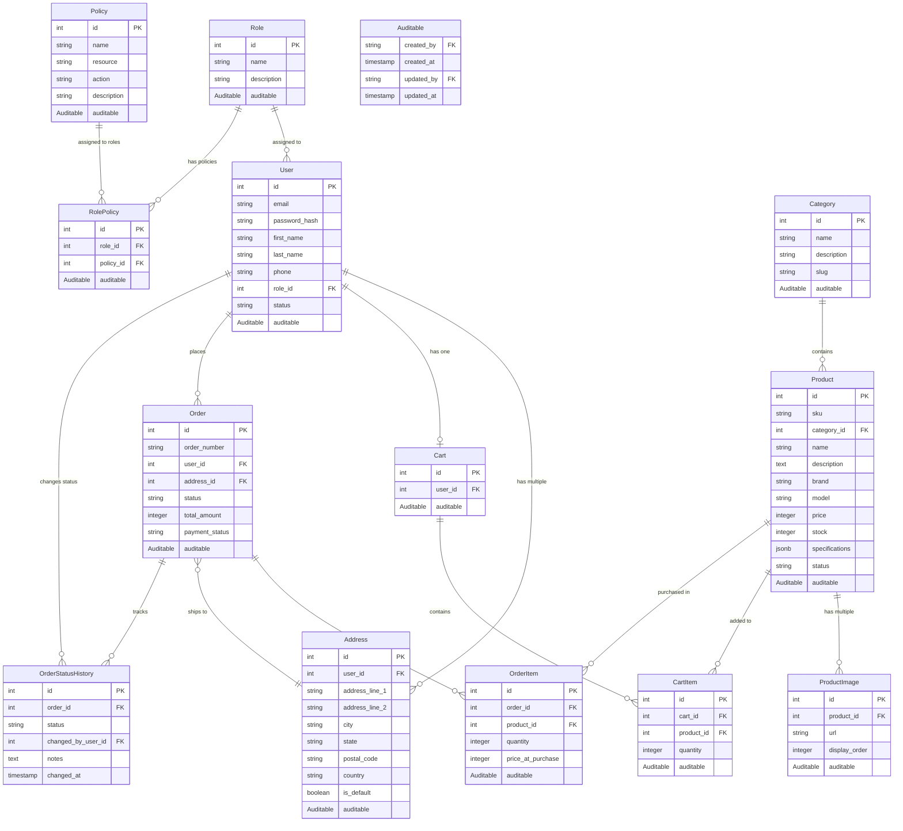

# Database Design — PC Parts E-Commerce Platform

**Version:** 1.1  
**Last Updated:** March 15, 2026

This document defines the database schema, including tables, fields, relationships, and the RBAC (Role-Based Access Control) implementation.

---

## Entity-Relationship Diagram



---

## Role-Based Access Control (RBAC)

This system uses **RBAC (Role-Based Access Control)** with **Policy-Based Authorization** for fine-grained access control.

### Architecture

```
User → Role → Policies
```

- A **User** is assigned one **Role**
- A **Role** has multiple **Policies** (many-to-many)
- A **Policy** defines an action that can be performed on a resource

### RBAC Tables

#### `roles`
| Field | Type | Description |
|---|---|---|
| `id` | INTEGER | Primary key (auto-incremented) |
| `name` | VARCHAR(50) | Unique role name (e.g., "Customer", "Manager") |
| `description` | TEXT | Human-readable description |
| `Auditable` | — | created_by, created_at, updated_by, updated_at |

#### `policies`
| Field | Type | Description |
|---|---|---|
| `id` | INTEGER | Primary key (auto-incremented) |
| `name` | VARCHAR(100) | Unique policy name (e.g., "products:create") |
| `resource` | VARCHAR(50) | Resource type (e.g., "products", "orders") |
| `action` | VARCHAR(50) | Action type (e.g., "create", "read", "update", "delete") |
| `description` | TEXT | Human-readable description |
| `Auditable` | — | created_by, created_at, updated_by, updated_at |

**Naming Convention:** `resource:action` (e.g., `products:create`, `orders:update`)

#### `role_policies` (Junction Table)
| Field | Type | Description |
|---|---|---|
| `id` | INTEGER | Primary key (auto-incremented) |
| `role_id` | INTEGER | Foreign key to roles |
| `policy_id` | INTEGER | Foreign key to policies |
| `Auditable` | — | created_by, created_at, updated_by, updated_at |

**Constraints:**
- Unique constraint on `(role_id, policy_id)`
- `ON DELETE CASCADE` for role_id
- `ON DELETE RESTRICT` for policy_id

### Policy Examples

**Products:**
- `products:list` — View product catalog
- `products:read` — View product details
- `products:create` — Create new products
- `products:update` — Update existing products
- `products:delete` — Delete products

**Orders:**
- `orders:list` — View order list
- `orders:read` — View order details
- `orders:create` — Place new orders
- `orders:update` — Update order status
- `orders:cancel` — Cancel orders

**Users:**
- `users:read` — View user details
- `users:create` — Create new users
- `users:update` — Update user information
- `users:delete` — Delete users

**Cart:**
- `cart:manage` — Add/remove/update cart items

**Categories:**
- `categories:list` — View categories
- `categories:read` — View category details
- `categories:create` — Create categories
- `categories:update` — Update categories
- `categories:delete` — Delete categories

**Roles & Policies:**
- `roles:manage` — Manage roles and role-policy assignments
- `policies:manage` — Manage policies

### Role-Policy Mappings

**Customer:**
- `products:list`, `products:read`
- `orders:create`, `orders:read`
- `cart:manage`

**Staff:**
- `products:list`, `products:read`
- `orders:list`, `orders:read`, `orders:update`

**Manager:**
- All Staff policies PLUS:
- `products:create`, `products:update`, `products:delete`
- `orders:cancel`
- `users:read`
- `categories:create`, `categories:update`

**SuperAdmin:**
- All policies (full system access)

---

## Auditable Interface

Common audit fields applied to most tables:

| Field | Type | Description |
|---|---|---|
| `created_by` | VARCHAR(100) | Username/identifier of who created the record (nullable) |
| `created_at` | TIMESTAMPTZ | Timestamp of creation |
| `updated_by` | VARCHAR(100) | Username/identifier of who last updated the record (nullable) |
| `updated_at` | TIMESTAMPTZ | Timestamp of last update |

**Tables with Auditable:**
- All RBAC tables (roles, policies, role_policies)
- users, addresses
- categories, products, product_images
- carts, cart_items
- orders, order_items

**Exception:** `order_status_history` uses `changed_by_user_id` and `changed_at` instead.

---

## Database Tables

### User Management

#### `users`
| Field | Type | Description |
|---|---|---|
| `id` | INTEGER | Primary key (auto-incremented) |
| `email` | VARCHAR(255) | Unique, used for login |
| `password_hash` | VARCHAR(255) | Bcrypt hashed password |
| `first_name` | VARCHAR(100) | User's first name |
| `last_name` | VARCHAR(100) | User's last name |
| `phone` | VARCHAR(20) | Phone number |
| `role_id` | INTEGER | Foreign key to roles |
| `status` | VARCHAR(50) | Active, Suspended |
| `Auditable` | — | Audit fields |

#### `addresses`
| Field | Type | Description |
|---|---|---|
| `id` | INTEGER | Primary key (auto-incremented) |
| `user_id` | INTEGER | Foreign key to users |
| `address_line_1` | VARCHAR(255) | Street address |
| `address_line_2` | VARCHAR(255) | Apartment, suite, etc. (optional) |
| `city` | VARCHAR(100) | City |
| `state` | VARCHAR(100) | State/province |
| `postal_code` | VARCHAR(20) | ZIP/postal code |
| `country` | VARCHAR(100) | Country |
| `is_default` | BOOLEAN | Default shipping address flag |
| `Auditable` | — | Audit fields |

---

### Product Catalog

#### `categories`
| Field | Type | Description |
|---|---|---|
| `id` | INTEGER | Primary key (auto-incremented) |
| `name` | VARCHAR(255) | Unique category name |
| `description` | TEXT | Category description |
| `slug` | VARCHAR(100) | Unique URL-friendly identifier |
| `Auditable` | — | Audit fields |

#### `products`
| Field | Type | Description |
|---|---|---|
| `id` | INTEGER | Primary key (auto-incremented) |
| `sku` | VARCHAR(100) | Unique stock-keeping unit |
| `category_id` | INTEGER | Foreign key to categories |
| `name` | VARCHAR(255) | Product name |
| `description` | TEXT | Product description |
| `brand` | VARCHAR(100) | Brand/manufacturer |
| `model` | VARCHAR(100) | Model number |
| `price` | INTEGER | Price in cents (e.g., 199999 = $1999.99) |
| `stock` | INTEGER | Current inventory quantity |
| `specifications` | JSONB | Category-specific technical specs |
| `status` | VARCHAR(50) | Active, Inactive |
| `Auditable` | — | Audit fields |

#### `product_images`
| Field | Type | Description |
|---|---|---|
| `id` | INTEGER | Primary key (auto-incremented) |
| `product_id` | INTEGER | Foreign key to products |
| `url` | VARCHAR(500) | Image URL (from storage service) |
| `display_order` | INTEGER | Sort order for display |
| `Auditable` | — | Audit fields |

---

### Shopping Cart

#### `carts`
| Field | Type | Description |
|---|---|---|
| `id` | INTEGER | Primary key (auto-incremented) |
| `user_id` | INTEGER | Foreign key to users (unique) |
| `Auditable` | — | Audit fields |

#### `cart_items`
| Field | Type | Description |
|---|---|---|
| `id` | INTEGER | Primary key (auto-incremented) |
| `cart_id` | INTEGER | Foreign key to carts |
| `product_id` | INTEGER | Foreign key to products |
| `quantity` | INTEGER | Number of units |
| `Auditable` | — | Audit fields |

---

### Orders

#### `orders`
| Field | Type | Description |
|---|---|---|
| `id` | INTEGER | Primary key (auto-incremented) |
| `order_number` | VARCHAR(50) | Unique order identifier |
| `user_id` | INTEGER | Foreign key to users |
| `address_id` | INTEGER | Foreign key to addresses |
| `status` | VARCHAR(50) | Order status (see statuses below) |
| `total_amount` | INTEGER | Total price in cents |
| `payment_status` | VARCHAR(50) | Pending, Confirmed, Failed, Refunded |
| `Auditable` | — | Audit fields |

**Order Statuses:**
- `PendingPayment` → `PaymentConfirmed` → `Processing` → `Preparing` → `Shipped` → `Delivered`
- Can transition to `Cancelled` before `Processing`

#### `order_items`
| Field | Type | Description |
|---|---|---|
| `id` | INTEGER | Primary key (auto-incremented) |
| `order_id` | INTEGER | Foreign key to orders |
| `product_id` | INTEGER | Foreign key to products |
| `quantity` | INTEGER | Number of units |
| `price_at_purchase` | INTEGER | Price snapshot in cents at order time |
| `Auditable` | — | Audit fields (created only, immutable) |

#### `order_status_history`
| Field | Type | Description |
|---|---|---|
| `id` | INTEGER | Primary key (auto-incremented) |
| `order_id` | INTEGER | Foreign key to orders |
| `status` | VARCHAR(50) | Status at this point in time |
| `changed_by_user_id` | INTEGER | User who changed status (nullable) |
| `notes` | TEXT | Optional notes |
| `changed_at` | TIMESTAMPTZ | Timestamp of change |

---

## Constraints & Indexes

### Unique Constraints
- `users.email`
- `roles.name`
- `policies.name`
- `role_policies (role_id, policy_id)` — composite unique
- `products.sku`
- `categories.name`
- `categories.slug`
- `carts.user_id` — one cart per user
- `orders.order_number`

### Foreign Key Constraints
- **CASCADE:** product_images, cart_items, order_items, order_status_history, role_policies (role)
- **RESTRICT:** products.category_id, orders.address_id, users.role_id, role_policies (policy)
- **SET NULL:** order_status_history.changed_by_user_id

### Indexes

**RBAC Indexes:**
- `users.role_id`
- `role_policies.role_id`
- `role_policies.policy_id`
- `policies.resource`

**Entity Indexes:**
- `users.email`
- `products.sku`
- `products.category_id`
- `products.status`
- `orders.user_id`
- `orders.order_number`
- `orders.status`
- `addresses.user_id`

**Composite Indexes:**
- `(products.category_id, products.status)` — category filtering
- `(orders.user_id, orders.created_at DESC)` — user order history