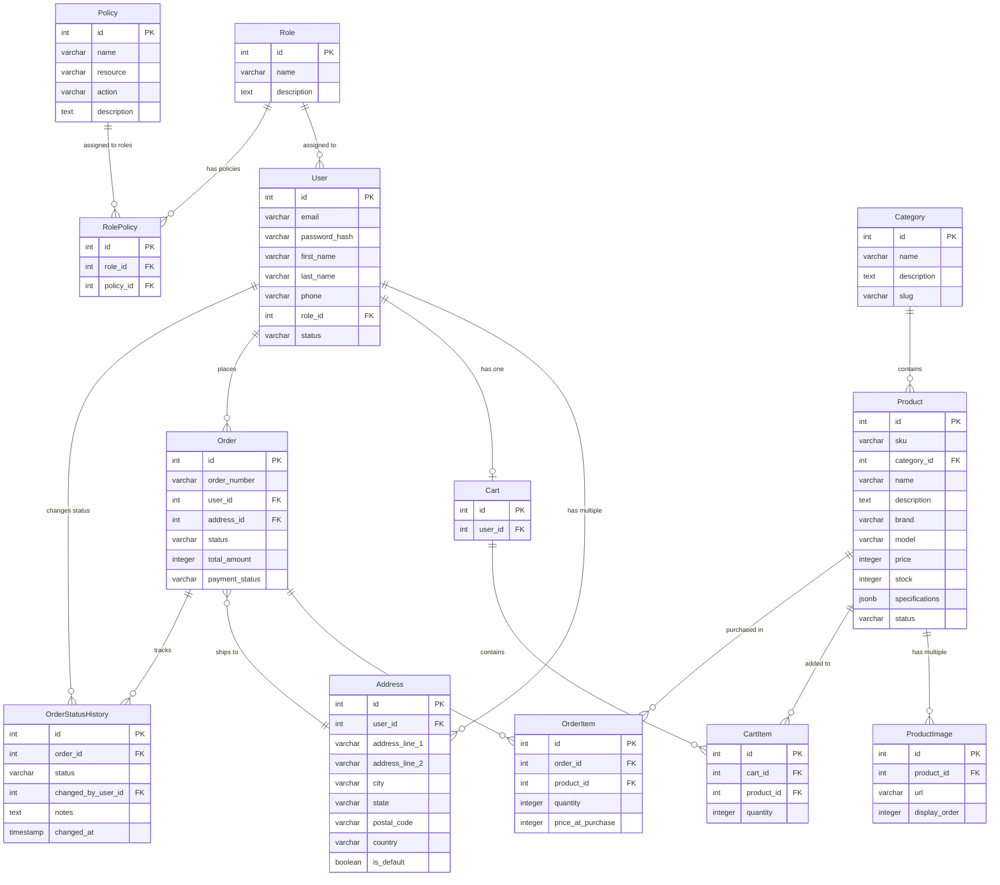

# Plan de Trabajo — Plataforma de E-Commerce para Componentes de PC

**Proyecto:** E-commerce de componentes de PC  
**Contexto:** Proyecto académico full-stack  
**Fecha:** 11 de marzo de 2026  
**Versión:** 1.0

---

## Tabla de Contenidos

1. [Definición del Proyecto](#definición-del-proyecto)
2. [Decisiones de Arquitectura y Patrones](#decisiones-de-arquitectura-y-patrones)
3. [Stack Tecnológico](#stack-tecnológico)
4. [Diseño de Base de Datos](#diseño-de-base-de-datos)
5. [Desglose de Tareas](#desglose-de-tareas)
6. [User Journey](#user-journey)
7. [Referencias](#referencias)

---

## Definición del Proyecto

### Descripción General

Plataforma e-commerce para venta de componentes de PC. Los clientes pueden navegar productos, gestionar carrito, realizar pedidos y rastrear estados. Incluye panel administrativo para gestión de productos, órdenes y usuarios con RBAC.

### Alcance Funcional

**Cliente:**
- Navegación y búsqueda de productos (categoría, marca, precio, stock)
- Visualización de especificaciones e imágenes
- Carrito persistente
- Checkout con dirección de envío
- Rastreo de órdenes
- Cancelación de órdenes pendientes

**Admin:**
- CRUD de productos con imágenes
- Control de inventario
- Administración de órdenes
- Gestión de usuarios y roles (SuperAdmin)
- Historial de cambios

**Sistema:**
- Autenticación JWT
- Autorización RBAC
- Notificaciones por email
- Imágenes en cloud storage
- API REST con Swagger
- Paginación y filtros

### Entidades Principales

1. **User** — Usuarios del sistema con roles asignados
2. **Role** — Roles del sistema (Customer, Staff, Manager, SuperAdmin)
3. **Policy** — Políticas de autorización vinculadas a roles
4. **Category** — Categorías de productos (CPUs, GPUs, RAM, etc.)
5. **Product** — Productos con especificaciones, imágenes, precio y stock
6. **Cart** — Carrito de compras vinculado a usuario
7. **Order** — Órdenes de compra con estados y historial
8. **Address** — Direcciones de envío de usuarios

### Arquitectura de Alto Nivel

```
┌─────────────────────────────────────────────────────────────┐
│                      Angular Frontend                       │
│        (Standalone Components + Angular Material)           │
└───────────────────────────┬─────────────────────────────────┘
                            │ HTTP/REST
                            │
┌───────────────────────────▼─────────────────────────────────┐
│                       NestJS API                            │
│                                                             │
│   ┌──────────────────────────────────────────────────┐      │
│   │  Presentation (Controllers + Guards)             │      │
│   │            │ consume ↓                           │      │
│   └──────────────────────┬───────────────────────────┘      │
│                          │                                  │
│   ┌──────────────────────▼───────────────────────────┐      │
│   │  Application (Services + Use Cases + DTOs)       │      │
│   │  - Commands/Queries + Handlers                   │      │
│   │  - IRepository<T>, IUserRepository, etc.         │      │
│   │            │ consume ↓                           │      │
│   └──────────────────────┬───────────────────────────┘      │
│                          │                                  │
│   ┌──────────────────────▼───────────────────────────┐      │
│   │         Domain (Entities + Domain Logic)         │      │
│   │                    [CORE]                        │      │
│   │  - User, Product, Order, Category                │      │
│   │  - Lógica de negocio encapsulada                 │      │
│   └──────────────────────────────────────────────────┘      │
│                          ↑                                  │
│                          │ implementa interfaces            │
│                          │ inyecta dependencias             │
│   ┌──────────────────────┴───────────────────────────┐      │
│   │  Infrastructure (Implementaciones concretas)     │      │
│   │  - BaseRepository<T>, UserRepository             │      │
│   │  - TypeORM DataSource, Config, Storage           │      │
│   └──────────────────────┬───────────────────────────┘      │
└───────────────────────────┬─────────────────────────────────┘
                            │
┌───────────────────────────▼─────────────────────────────────┐
│            Supabase PostgreSQL + Storage                    │
└─────────────────────────────────────────────────────────────┘
```

**Flujo de dependencias:**
1. **Domain:** No depende de nada (core)
2. **Application:** Depende de Domain (interfaces y servicios)
3. **Infrastructure:** Implementa interfaces (repositorios, ORM, config)
4. **Presentation:** Depende de Application (controllers)

Dependencias hacia adentro (inversión de dependencias).

---

## Decisiones de Arquitectura y Patrones

### Principios Fundamentales

#### 1. **Clean Architecture**

Arquitectura en capas:
- **Presentation:** Controllers (REST)
- **Application:** Services, Use Cases (Commands/Queries), DTOs
- **Domain:** Entities (lógica de negocio)
- **Infrastructure:** Repositories, ORM, config

**Beneficios:**
- Independencia de frameworks
- Fácil testing
- Flexibilidad en infraestructura

#### 2. **SOLID**

- **Single Responsibility:** Cada clase tiene una responsabilidad
- **Open/Closed:** Extensible vía herencia y composición
- **Liskov Substitution:** Interfaces intercambiables
- **Interface Segregation:** Interfaces específicas por contrato
- **Dependency Inversion:** DI mediante contenedor de NestJS

#### 3. **DRY**

Abstracciones creadas en el segundo uso:
- `BaseRepository<T>` y `BaseService<T>`
- Filtros y interceptores globales
- Decoradores personalizados

### Patrones de Diseño Implementados

#### Repository Pattern

Repository genérico (`IRepository<T>`) para acceso a datos.

**Ventajas:**
- Abstrae acceso a datos
- Mockeable en tests
- Cambio de ORM sin afectar servicios

#### Dependency Injection

Contenedor de DI nativo de NestJS:
- Servicios con `@Injectable()`
- Inyección por constructor
- Testing con mocks

#### Result Pattern

Respuestas consistentes:
- Éxito: `{ data: T | T[], meta?: {...} }`
- Error: `{ statusCode, message, error }`

#### Use Case Pattern (CQRS Light)

Separación de Commands y Queries por caso de uso.

**Estructura:**
- **Commands:** Operaciones que modifican estado (CreateProduct, UpdateCart, PlaceOrder)
  - Incluyen validaciones con `class-validator` (`@IsString()`, `@IsEmail()`, etc.)
  - Recibidos directamente por el Controller como `@Body()`
  - Reemplazan a los DTOs de entrada
- **Queries:** Operaciones de lectura (GetProductById, ListProducts, GetCart)
  - Incluyen validaciones para filtros y paginación (`@IsOptional()`, `@IsInt()`, etc.)
  - Recibidos directamente por el Controller como `@Query()`
- **Handlers:** Ejecutan la lógica de negocio de cada Use Case
  - Mapean Command/Query → Domain Entity
  - Llaman al Repository
  - Mapean Domain Entity → Response DTO
- **Response DTOs:** Solo para respuestas (UserResponseDto, ProductResponseDto)
  - Con decoradores `@ApiProperty()` para Swagger

**Ventajas:**
- Responsabilidad única por caso de uso
- Fácil de testear aisladamente
- Controllers delgados y genéricos (solo reciben y delegan)
- Servicios no se vuelven "god classes"
- Código más mantenible y escalable
- Sin redundancia DTO + Command

**Ejemplo de estructura:**
```
application/use-cases/
  products/
    commands/
      create-product.command.ts    # Con @IsString(), @IsNumber() validations
      create-product.handler.ts    # Mapea Command → Domain → Response DTO
    queries/
      get-product-by-id.query.ts   # Con @IsUUID() validation
      get-product-by-id.handler.ts # Consulta y mapea Domain → Response DTO
dtos/
  products/
    product-response.dto.ts        # Solo respuestas
```

#### Domain-Driven Design (DDD)

Entidades con comportamiento:
- Lógica de negocio en entidades
- Factory methods
- Campos privados con getters
- Validaciones en el dominio

### Decisiones Basadas en .NET

Tecnologías elegidas por similitud con .NET/C#:

| .NET / C# | Node.js / TypeScript |
|-----------|---------------------|
| ASP.NET Core | NestJS |
| Entity Framework | TypeORM |
| `IServiceCollection` | NestJS Modules + `@Injectable()` |
| `DbContext` | TypeORM `DataSource` |
| `Repository<T>` | TypeORM `Repository<T>` + BaseRepository |
| `[Authorize]` | `@UseGuards(JwtAuthGuard)` |
| Data Annotations | `class-validator` decorators |
| Swashbuckle (Swagger) | `@nestjs/swagger` |
| `appsettings.json` | `.env` + `ConfigService` |
| xUnit + Moq | Jest + `jest-mock-extended` |

**Beneficios:**
- Curva de aprendizaje reducida
- Patrones conocidos
- Productividad desde el inicio

### Database-First

Migraciones manuales en SQL.

**Razones:**
- Control total sobre el esquema
- Scripts versionados
- SQL optimizado

**Proceso:**
1. Escribir SQL en `database/sql/migrations/`
2. Aplicar en Supabase SQL Editor
3. Crear wrapper TypeORM (opcional)
4. Versionar en Git

### Testing Strategy

Prioridad: **tests de integración** con DB real.

**Enfoque:**
- Tests con `.env.test`
- Nivel servicios (DTO → Service → Repository → DB)
- Debugging con breakpoints

**Unit tests solo para:**
- Utilities
- Validators
- Helpers

---

## Stack Tecnológico

### Backend

| Decisión | Justificación |
|----------|---------------|
| **NestJS** | Framework similar a ASP.NET Core: DI nativo, decoradores (atributos C#), módulos/controllers/guards, Clean Architecture natural, familiar para .NET developers |
| **TypeORM** | ORM similar a Entity Framework: decoradores para entidades, `Repository<T>` built-in, migraciones, relaciones tipadas, compatible con PostgreSQL |
| **TypeScript** | Tipificación fuerte, build-step validation, errores en compilación, refactoring seguro, generics type-safe, decorators |
| **class-validator** | Decoradores de validación en DTOs (equivalente a Data Annotations), validación automática vía `ValidationPipe` |
| **class-transformer** | Transformación type-safe de plain objects a instancias de clases |
| **Passport + JWT** | Control total del flujo auth, JWT stateless, integración directa con Guards, sin dependencia de servicios externos |
| **bcrypt** | Hashing seguro de contraseñas según estándares |
| **Supabase PostgreSQL** | PostgreSQL gestionado con free tier, acceso directo vía TypeORM (sin SDK), SQL Editor, backups automáticos, Storage integrado |
| **@nestjs/swagger** | Documentación automática en `/api/docs`, schemas desde DTOs con decoradores |
| **Jest** | Testing con enfoque en integration tests con DB real (`.env.test`), debugging con breakpoints |
| **Bruno** | API testing con colecciones por módulo (`docs/bruno/`), versionadas en Git |
| **Vercel** | Deployment automático desde Git, SSL y CDN incluidos, soporte NestJS, free tier disponible |

### Frontend

| Decisión | Justificación |
|----------|---------------|
| **Angular** | Framework estructurado (similar a .NET MVC), DI nativo, TypeScript principal, standalone components (sin NgModules), Signals para estado local, CLI robusto |
| **Angular Material** | Componentes pre-built, theming consistente, accesibilidad built-in, responsive, mantenido por Google |
| **TypeScript** | Type-safety end-to-end con backend, refactoring seguro, errores en compilación |
| **RxJS** | Solo donde Angular Material o HttpClient lo requieren, preferir Signals para estado |
| **Vercel** | Deployment automático desde Git, proyecto separado para UI, SSL y CDN incluidos, free tier disponible |

---

## Diseño de Base de Datos

### Diagrama Entidad-Relación

13 tablas organizadas en:
1. **RBAC:** `roles`, `policies`, `role_policies`
2. **Catálogo:** `categories`, `products`, `product_images`
3. **Transacciones:** `users`, `addresses`, `carts`, `cart_items`, `orders`, `order_items`, `order_status_history`



### Auditable Pattern

**Campos de auditoría:**
- `created_at`, `updated_at`, `created_by`, `updated_by`

**Implementación:**
TypeORM `EntitySubscriber` llena campos automáticamente desde contexto del usuario.

### Decisiones de Diseño

#### 1. Integers como Primary Keys
Se utilizan integers autoincrementales en lugar de UUIDs.

**Ventajas:**
- Mayor rendimiento en índices y JOINs
- Menor consumo de almacenamiento
- Facilidad de depuración y lectura de IDs
- Estándar en la mayoría de bases de datos relacionales

#### 2. Precios en Centavos (Integers)
Los precios se almacenan como `INTEGER` en centavos (ej: 4999 = $49.99)

**Ventajas:**
- Evita problemas de precisión de punto flotante
- Aritmética exacta para cálculos de totales
- Patrón estándar en sistemas de pagos (Stripe, PayPal)

#### 3. JSONB para Especificaciones
Las especificaciones técnicas de productos se almacenan como `JSONB`.

**Ventajas:**
- Esquema flexible por categoría de producto (CPUs tienen specs diferentes a GPUs)
- Índices GIN para búsquedas eficientes
- Validación a nivel de aplicación
- Evita crear decenas de columnas opcionales

#### 4. Snapshot de Precio en OrderItem
`order_items.price_at_purchase` guarda el precio al momento de compra.

**Razón:** Los precios cambian; se necesita histórico exacto.

#### 5. Status como VARCHAR
Estados se almacenan como `VARCHAR` en lugar de ENUMs.

**Razón:** Mayor flexibilidad; validación en application layer.

### Índices Principales

**Users:** email (unique), role_id  
**Products:** sku (unique), category_id, status  
**Orders:** order_number (unique), user_id, status, created_at  
**Todos los FK** tienen índices para optimizar JOINs

### RBAC (Role-Based Access Control)

#### Arquitectura

```
User → Role → Policies
```

- Un usuario tiene **un rol**
- Un rol tiene **múltiples políticas** (many-to-many vía `role_policies`)
- Una política define **una acción sobre un recurso**

#### Roles del Sistema

| Role | Description |
|------|-------------|
| **Customer** | Compra productos |
| **Staff** | Gestiona órdenes asignadas |
| **Manager** | Gestiona productos e inventario |
| **SuperAdmin** | Acceso completo |

#### Políticas (Ejemplos)

- `products:read`, `products:create`, `products:update`, `products:delete`
- `orders:read_own`, `orders:read_all`, `orders:update_status`
- `users:manage`, `roles:assign`

#### Implementación en el API

1. `JwtAuthGuard` verifica token
2. `PolicyGuard` valida permisos
3. `@RequirePolicy('resource:action')` en endpoints
4. 403 si no tiene permisos

### Migraciones

**Ubicación:** `database/sql/migrations/`

1. `001-rbac.sql`
2. `002-users.sql`
3. `003-products.sql`
4. `004-cart.sql`
5. `005-orders.sql`

**Rollbacks:** `database/sql/rollbacks/`  
**Seeds:** `database/sql/seeds/`

### Integridad Referencial

- `ON DELETE RESTRICT` por defecto
- `ON DELETE CASCADE` en dependientes
- `CHECK` constraints (`price > 0`, `stock >= 0`)
- Unique en `email`, `sku`, `order_number`
- Not null donde aplique

### Consideraciones de Rendimiento

1. Índices en todas las FK
2. Índices compuestos para queries comunes
3. JSONB GIN Index para especificaciones
4. Paginación obligatoria
5. Eager loading para evitar N+1

---

## Desglose de Tareas

Tareas organizadas por fases.

### Fase 1: Análisis y Documentación

**Estado:** ✅ Completado

| # | Tarea | Estado |
|---|-------|--------|
| 1.1 | Definir requerimientos funcionales y no funcionales | ✅ |
| 1.2 | Diseñar arquitectura del sistema y capas | ✅ |
| 1.3 | Diseñar esquema de base de datos (ERD) | ✅ |
| 1.4 | Definir flujos de usuario (User Journey) | ✅ |
| 1.5 | Crear roadmap de implementación | ✅ |
| 1.6 | Establecer estándares de código | ✅ |

**Criterios:**
- Docs creados y versionados
- ERD validado
- User stories por rol

---

### Fase 2: Configuración del Entorno

**Estado:** ✅ Completado

| # | Tarea | Estado |
|---|-------|--------|
| 2.1 | Crear estructura de monorepo (api/ y ui/) | ✅ |
| 2.2 | Configurar proyecto NestJS con TypeScript | ✅ |
| 2.3 | Configurar proyecto Angular con standalone components | ✅ |
| 2.4 | Configurar base de datos en Supabase | ✅ |
| 2.5 | Configurar TypeORM DataSource | ✅ |
| 2.6 | Configurar variables de entorno (.env) | ✅ |
| 2.7 | Aplicar migraciones SQL a Supabase | ✅ |
| 2.8 | Aplicar seeds de prueba | ✅ |
| 2.9 | Crear suite de integration tests | ✅ |

**Criterios:**
- NestJS arranca sin errores
- Angular compila
- Conexión a DB funcional
- 13 tablas creadas
- Seeds aplicados
- Tests pasan (1 test config)

---

### Fase 3: Implementación Backend - Infraestructura

**Estado:** 🚧 En progreso (95% completado)

| # | Tarea | Estado |
|---|-------|--------|
| 3.1 | Implementar todas las entidades de dominio | ✅ |
| 3.2 | Implementar BaseRepository con generics | ✅ |
| 3.3 | Implementar repositorios específicos | ✅ |
| 3.4 | Implementar interfaces de repositorios | ✅ |
| 3.5 | Implementar AuditSubscriber para timestamps | ✅ |
| 3.6 | Crear Response DTOs para todos los módulos | ✅ |
| 3.7 | Configurar ValidationPipe global | ⏳ |
| 3.8 | Implementar ResponseInterceptor | ✅ |
| 3.9 | Implementar HttpExceptionFilter | ✅ |
| 3.10 | Configurar Swagger documentation | ✅ |
| 3.11 | Implementar infraestructura de Use Cases (ICommand, IQuery) | ✅ |
| 3.12 | Implementar CommandHandler y QueryHandler base | ✅ |
| 3.13 | Configurar estructura de carpetas application/features/ | ✅ |

**Criterios:**
- Entidades mapeadas
- CRUD en repositorios
- Response DTOs con @ApiProperty() decorators
- Swagger en `/api/docs`
- Infraestructura de Use Cases lista

---

### Fase 4: Implementación Backend - Autenticación y Autorización

**Estado:** 🚧 En progreso

| # | Tarea | Estado |
|---|-------|--------|
| 4.1 | Implementar AuthService (register, login) | ⏳ |
| 4.2 | Implementar JWT strategy con Passport | 🚧 |
| 4.3 | Implementar JwtAuthGuard | ✅ |
| 4.4 | Implementar PolicyGuard para RBAC | ✅ |
| 4.5 | Crear decoradores @Public() y @RequirePolicy() | ✅ |
| 4.6 | Implementar password hashing con bcrypt | ⏳ |

**Criterios:**
- Register y login funcionales
- JWT emitido
- Endpoints protegidos
- RBAC operativo
- Tests pasan

---

### Fase 5: Implementación Backend - Módulos de Negocio

**Estado:** 🚧 En progreso (80% completado)

#### 5.1 Módulo de Categorías

| # | Tarea | Estado |
|---|-------|--------|
| 5.1.1 | Implementar Use Cases (GetAllCategories, GetCategoryById) | ✅ |
| 5.1.2 | Implementar CategoriesService usando Use Cases | ✅ |
| 5.1.3 | Implementar CategoriesController | ✅ |
| 5.1.4 | Crear integration tests | ⏳ |
| 5.1.5 | Crear colección Bruno | ⏳ |

#### 5.2 Módulo de Productos

| # | Tarea | Estado |
|---|-------|--------|
| 5.2.1 | Implementar Commands (CreateProduct, UpdateProduct, DeleteProduct) | ✅ |
| 5.2.2 | Implementar Queries (GetProductById, ListProducts, SearchProducts) | 🚧 |
| 5.2.3 | Implementar ProductsService usando Use Cases | ✅ |
| 5.2.4 | Implementar ProductsController | ✅ |
| 5.2.5 | Implementar upload de imágenes a Supabase Storage | ⏳ |
| 5.2.6 | Implementar filtros (category, price, brand, stock) | ⏳ |
| 5.2.7 | Implementar búsqueda por nombre/SKU | ⏳ |
| 5.2.8 | Implementar paginación | ✅ |
| 5.2.9 | Crear integration tests | ⏳ |
| 5.2.10 | Crear colección Bruno | ⏳ |

#### 5.3 Módulo de Carrito

| # | Tarea | Estado |
|---|-------|--------|
| 5.3.1 | Implementar Commands (AddItemToCart, UpdateCartItem, RemoveCartItem, ClearCart) | ✅ |
| 5.3.2 | Implementar Query (GetCart) | ✅ |
| 5.3.3 | Implementar CartService usando Use Cases | ✅ |
| 5.3.4 | Implementar CartController | ✅ |
| 5.3.5 | Implementar validación de stock | ⏳ |
| 5.3.6 | Crear integration tests | ⏳ |
| 5.3.7 | Crear colección Bruno | ⏳ |

#### 5.4 Módulo de Órdenes

| # | Tarea | Estado |
|---|-------|--------|
| 5.4.1 | Implementar Commands (CreateOrder, UpdateOrderStatus, CancelOrder) | ✅ |
| 5.4.2 | Implementar Queries (GetOrderById, ListOrders, GetOrderHistory) | ✅ |
| 5.4.3 | Implementar OrdersService usando Use Cases | ✅ |
| 5.4.4 | Implementar OrdersController | ✅ |
| 5.4.5 | Implementar workflow de estados (Pending → Delivered) | ⏳ |
| 5.4.6 | Implementar OrderStatusHistory tracking | ✅ |
| 5.4.7 | Implementar cancelación de órdenes | ⏳ |
| 5.4.8 | Implementar reserva de stock en PaymentConfirmed | ⏳ |
| 5.4.9 | Crear integration tests | ⏳ |
| 5.4.10 | Crear colección Bruno | ⏳ |

**Nota:** Los 13 módulos del sistema ya cuentan con handlers de CRUD básico, repositorios, mappers y controladores implementados. Pendiente implementar lógica de negocio avanzada y tests.

**Criterios Fase 5:**
- Endpoints CRUD + filtros operativos
- Carrito persistente
- Flujo de órdenes completo
- Reserva de stock funcional
- Tests >80% coverage
- Bruno collections completas

---

### Fase 6: Documentación y Pruebas Backend

**Estado:** ⏳ Pendiente

| # | Tarea | Estado |
|---|-------|--------|
| 6.1 | Completar decoradores Swagger en DTOs | 🚧 |
| 6.2 | Agregar ejemplos a Swagger | ⏳ |
| 6.3 | Completar colecciones Bruno | ⏳ |
| 6.4 | Escribir integration tests faltantes | ⏳ |
| 6.5 | Validar todos los endpoints con Bruno | ⏳ |

---

### Fase 7: Implementación Frontend - Estructura Base

**Estado:** 🚧 En progreso (80% completado)

| # | Tarea | Estado |
|---|-------|--------|
| 7.1 | Configurar routing con lazy loading | ✅ |
| 7.2 | Crear layout principal (header, sidebar, footer) | 🚧 |
| 7.3 | Implementar AuthService (login, register, logout) | ✅ |
| 7.4 | Implementar AuthGuard para rutas protegidas | ✅ |
| 7.5 | Implementar HttpInterceptor para JWT | ✅ |
| 7.6 | Crear componentes genéricos (Button, Card, Table) | 🚧 |
| 7.7 | Configurar Angular Material theming | ✅ |

**Criterios:**
- Routing con lazy loading
- Layout responsive
- Auth completo
- JWT auto en requests
- Componentes genéricos

---

### Fase 8: Implementación Frontend - Funcionalidades

**Estado:** 🚧 En progreso (40% completado)

#### 8.1 Módulo de Productos (Cliente)

| # | Tarea | Estado |
|---|-------|--------|
| 8.1.1 | Implementar ProductListComponent con filtros | ✅ |
| 8.1.2 | Implementar ProductDetailComponent | ✅ |
| 8.1.3 | Implementar filtros (categoría, precio, marca) | ⏳ |
| 8.1.4 | Implementar búsqueda con debounce | ⏳ |
| 8.1.5 | Implementar paginación | 🚧 |

#### 8.2 Módulo de Carrito

| # | Tarea | Estado |
|---|-------|--------|
| 8.2.1 | Implementar CartService | ✅ |
| 8.2.2 | Implementar CartComponent | 🚧 |
| 8.2.3 | Implementar add/update/remove items | 🚧 |
| 8.2.4 | Mostrar totales y subtotales | ⏳ |

#### 8.3 Módulo de Checkout y Órdenes

| # | Tarea | Estado |
|---|-------|--------|
| 8.3.1 | Implementar CheckoutComponent | ⏳ |
| 8.3.2 | Implementar selección de dirección | ⏳ |
| 8.3.3 | Implementar confirmación de orden | ⏳ |
| 8.3.4 | Implementar OrderHistoryComponent | ⏳ |
| 8.3.5 | Implementar OrderDetailComponent | ⏳ |

#### 8.4 Módulo Admin

| # | Tarea | Estado |
|---|-------|--------|
| 8.4.1 | Implementar AdminDashboard | ✅ |
| 8.4.2 | Implementar Product Management (CRUD) | ⏳ |
| 8.4.3 | Implementar Order Management (list + update status) | ⏳ |
| 8.4.4 | Implementar User Management (SuperAdmin) | ⏳ |

**Criterios Fase 8:**
- Flows cliente operativos
- Admin gestiona productos/órdenes/users
- UI responsive
- Feedback visual
- Navegación fluida

---

### Fase 9: Testing End-to-End (E2E)

**Estado:** ⏳ Pendiente

| # | Tarea | Estado |
|---|-------|--------|
| 9.1 | Configurar Cypress o Playwright | ⏳ |
| 9.2 | Escribir tests E2E para user journey cliente | ⏳ |
| 9.3 | Escribir tests E2E para admin | ⏳ |
| 9.4 | Ejecutar suite completa de E2E | ⏳ |

**User journeys:**
- Cliente: Registro → Login → Browse → Cart → Checkout → Confirmación
- Admin: Login → Create Product → Update Stock → Process Order

---

### Fase 10: Despliegue y Optimización

**Estado:** ⏳ Pendiente

| # | Tarea | Estado |
|---|-------|--------|
| 10.1 | Configurar Vercel project para API | ⏳ |
| 10.2 | Configurar Vercel project para UI | ⏳ |
| 10.3 | Configurar variables de entorno en Vercel | ⏳ |
| 10.4 | Deploy inicial a producción | ⏳ |
| 10.5 | Configurar GitHub Actions para CI/CD | ⏳ |
| 10.6 | Optimización de builds (Angular) | ⏳ |
| 10.7 | Testing en producción | ⏳ |
| 10.8 | Documentar URLs y accesos | ⏳ |

**Criterios:**
- API y UI desplegados
- CI/CD funcional
- Logs configurados
- Docs actualizadas

---

### Fase 11: Documentación Final

**Estado:** 🚧 En progreso

| # | Tarea | Estado |
|---|-------|--------|
| 11.1 | Crear video demostrativo de endpoints (Bruno) | ⏳ |
| 11.2 | Crear video demostrativo de UI (flows) | ⏳ |
| 11.3 | Preparar presentación de arquitectura | ⏳ |
| 11.4 | Crear README.md para repositorio | ⏳ |
| 11.5 | Revisar y actualizar documentación | 🚧 |

---

## User Journey

### Diagrama de Flujo del Cliente


### Descripción del Flujo del Cliente

1. **Homepage**
   - Landing page con productos destacados
   - Barra de búsqueda global
   - Navegación por categorías
   - Call-to-action para registro

2. **Exploración de Productos**
   - Lista de productos con imágenes y precio
   - Filtros (categoría, precio, marca, disponibilidad)
   - Búsqueda por nombre o SKU
   - Ordenamiento (precio, nombre, fecha)
   - Paginación (20 productos por página)

3. **Detalle de Producto**
   - Galería de imágenes
   - Especificaciones técnicas completas
   - Precio y disponibilidad de stock
   - Botón "Agregar al Carrito"
   - Productos relacionados (opcional)

4. **Carrito de Compras**
   - Lista de items con imagen, nombre, precio unitario, cantidad
   - Controles para actualizar cantidades
   - Eliminar items
   - Mostrar subtotal y total
   - Advertencias si productos sin stock
   - Botón "Proceder al Checkout"

5. **Checkout**
   - Requiere autenticación
   - Selección de dirección de envío (o crear nueva)
   - Resumen de la orden
   - Simulación de pago (mock)
   - Confirmación de orden

6. **Post-Compra**
   - Página de confirmación con número de orden
   - Email de confirmación (PaymentConfirmed)
   - Acceso a historial de órdenes
   - Detalle de orden con estado actual
   - Posibilidad de cancelar si estado = PendingPayment

### Diagrama de Flujo del Administrador


### Descripción del Flujo del Administrador

#### Staff (Empleado)
- Ver órdenes asignadas
- Actualizar estado de órdenes (Processing → Preparing → Shipped)
- Ver detalles de órdenes
- No puede crear productos ni gestionar usuarios

#### Manager (Gerente)
- **Gestión de Productos:**
  - Crear nuevos productos con especificaciones
  - Editar productos existentes
  - Subir imágenes (1-5 por producto)
  - Activar/desactivar productos
  - Ajustar stock manualmente

- **Gestión de Órdenes:**
  - Ver todas las órdenes del sistema
  - Filtrar por estado, fecha, cliente
  - Actualizar cualquier orden
  - Ver historial completo de cambios

- **Control de Inventario:**
  - Ver niveles de stock en tiempo real
  - Recibir alertas de stock bajo (opcional)
  - Ajustar cantidades de inventario

#### SuperAdmin (Administrador del Sistema)
- **Todas las capacidades de Manager, más:**

- **Gestión de Usuarios:**
  - Crear cuentas de usuario
  - Asignar roles (Customer, Staff, Manager, SuperAdmin)
  - Suspender/activar cuentas
  - Ver actividad de usuarios
  - Resetear contraseñas (opcional)

- **Configuración del Sistema:**
  - Gestionar políticas RBAC
  - Ver logs del sistema (opcional)
  - Configurar notificaciones por email

### Puntos de Interacción Clave

| Acción | Rol Requerido | Política RBAC |
|--------|---------------|---------------|
| Navegar catálogo | Público | N/A |
| Ver detalle de producto | Público | N/A |
| Agregar al carrito | Customer | N/A |
| Realizar checkout | Customer | `orders:create_own` |
| Ver órdenes propias | Customer | `orders:read_own` |
| Cancelar orden propia | Customer | `orders:cancel_own` |
| Ver órdenes asignadas | Staff | `orders:read_assigned` |
| Actualizar estado de orden | Staff/Manager | `orders:update_status` |
| Ver todas las órdenes | Manager | `orders:read_all` |
| Crear productos | Manager | `products:create` |
| Editar productos | Manager | `products:update` |
| Desactivar productos | Manager | `products:delete` |
| Gestionar usuarios | SuperAdmin | `users:manage` |
| Asignar roles | SuperAdmin | `roles:assign` |

### Estados de Orden y Transiciones

```
Cliente crea orden
    ↓
[PendingPayment]
    ├─→ [Cancelled] (cliente cancela)
    │
    ↓ (pago simulado exitoso)
[PaymentConfirmed] (stock reservado)
    │
    ↓ (Staff procesa)
[Processing]
    │
    ↓ (productos empacados)
[Preparing]
    │
    ↓ (orden enviada)
[Shipped] (email enviado)
    │
    ↓ (confirmación de entrega)
[Delivered]
```

---

## Referencias

### Documentación Interna

1. [SYSTEM-OVERVIEW.md](./SYSTEM-OVERVIEW.md) — Requerimientos funcionales y entidades
2. [TECHNICAL-ARCHITECTURE.md](./TECHNICAL-ARCHITECTURE.md) — Arquitectura técnica y stack
3. [DATABASE-DESIGN.md](./DATABASE-DESIGN.md) — Diseño de base de datos y RBAC
4. [API-IMPLEMENTATION-ROADMAP.md](./API-IMPLEMENTATION-ROADMAP.md) — Roadmap detallado de implementación
5. [UX-DESIGN.md](./UX-DESIGN.md) — Wireframes y flujos de usuario
6. [copilot-instructions.md](../.github/copilot-instructions.md) — Estándares de código

### Documentación Externa

#### NestJS
- [NestJS Documentation](https://docs.nestjs.com/)
- [NestJS Fundamentals](https://docs.nestjs.com/first-steps)
- [NestJS Testing](https://docs.nestjs.com/fundamentals/testing)
- [NestJS Guards & Authorization](https://docs.nestjs.com/guards)

#### TypeORM
- [TypeORM Documentation](https://typeorm.io/)
- [TypeORM Entity Documentation](https://typeorm.io/entities)
- [TypeORM Relations](https://typeorm.io/relations)
- [TypeORM Repository API](https://typeorm.io/repository-api)

#### Angular
- [Angular Documentation](https://angular.dev/)
- [Angular Standalone Components](https://angular.dev/guide/components)
- [Angular Signals](https://angular.dev/guide/signals)
- [Angular Router](https://angular.dev/guide/routing)

#### Angular Material
- [Angular Material Components](https://material.angular.io/components)
- [Angular Material Theming](https://material.angular.io/guide/theming)

#### Supabase
- [Supabase Documentation](https://supabase.com/docs)
- [Supabase PostgreSQL](https://supabase.com/docs/guides/database/overview)
- [Supabase Storage](https://supabase.com/docs/guides/storage)

### Repositorio

- **GitHub:** `didactic-madness`
- **Estructura:** Monorepo con `api/` y `ui/`
- **Branch principal:** `main`
- **Branch de desarrollo:** `develop`

---

**Fin del documento**
