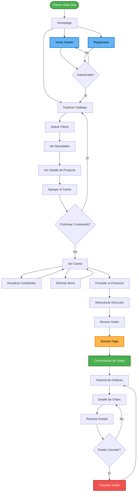
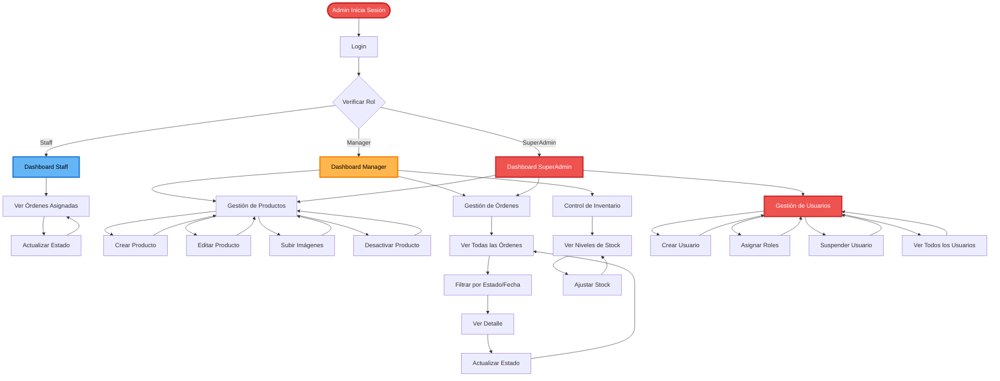

# Plan de Trabajo — Plataforma de E-Commerce para Componentes de PC

**Proyecto:** E-commerce de componentes de PC  
**Contexto:** Proyecto académico full-stack  
**Fecha:** 22 de marzo de 2026  
**Versión:** 4.0 (Ultra-Detailed API Focus)

---

## 1. Definición del Proyecto
Plataforma e-commerce para venta de componentes de PC con arquitectura Clean, DDD y enfoque en integridad de datos. Este plan se enfoca exclusivamente en la **implementación completa de la API**.

---

## 2. Stack Tecnológico (Justificación Técnica)

| Tecnología | Versión | Justificación |
|------------|---------|---------------|
| **NestJS** | 11.x | Provee un sistema de Inyección de Dependencias y modularidad que facilita el testing y la separación de capas. |
| **TypeORM** | 0.3.x | Permite gestionar transacciones complejas y relaciones relacionales con tipado fuerte de TypeScript. |
| **PostgreSQL** | 16.x | Soporta tipos `JSONB` para especificaciones técnicas y garantiza ACID para la consistencia de inventario. |
| **Passport/JWT** | 0.7.x | Estándar para autenticación desacoplada, permitiendo que la API sea stateless y escalable. |
| **Bcrypt** | 6.x | Hashing adaptativo para proteger las credenciales de los usuarios contra ataques de fuerza bruta. |

---

## 3. Desglose de Tareas Detallado (Backend API)

### Fase 1: Infraestructura y Patrones de Diseño
**Objetivo:** Establecer la base técnica para un desarrollo escalable y mantenible.

| # | Tarea | Descripción | Justificación (¿Por qué?) | Estado |
|---|-------|-------------|---------------------------|--------|
| 1.1 | **Dominio Core** | Definición de Entidades de Dominio (User, Product, Order) con lógica encapsulada. | Para centralizar las reglas de negocio y evitar que se dispersen en los servicios. | ✅ |
| 1.2 | **BaseRepository** | Implementación de repositorio genérico con soporte de `QueryRunner`. | Para reutilizar lógica de acceso a datos y permitir transacciones atómicas. | ✅ |
| 1.3 | **Result Pattern** | Implementación de interceptores para normalizar respuestas `{ data, meta }`. | Para que el frontend siempre reciba un contrato de respuesta predecible. | ✅ |
| 1.4 | **Audit System** | Implementación de `AuditSubscriber` para campos de trazabilidad. | Para saber quién y cuándo modificó cada registro sin código manual repetitivo. | ✅ |
| 1.5 | **Exception Mapping**| Filtros globales para transformar errores de dominio en códigos HTTP (400, 403, 404). | Para no exponer detalles técnicos de la base de datos al cliente. | ✅ |

---

### Fase 2: Autenticación, Usuarios y RBAC
**Objetivo:** Garantizar que cada usuario solo acceda a lo que tiene permitido.

| # | Tarea | Descripción | Justificación (¿Por qué?) | Estado |
|---|-------|-------------|---------------------------|--------|
| 2.1 | **Login/Register** | Flujo de autenticación con emisión de JWT y hashing Bcrypt. | Para asegurar la identidad de los usuarios y proteger sus contraseñas. | ✅ |
| 2.2 | **PolicyGuard** | Implementación de validación de permisos granulares (`resource:action`). | Para permitir que los permisos sean configurables desde la DB sin cambiar código. | ✅ |
| 2.3 | **Address CRUD** | Gestión de múltiples direcciones de envío por usuario. | Necesario para el checkout; permite al cliente guardar ubicaciones recurrentes. | ✅ |
| 2.4 | **Profile Update** | Edición de datos personales (nombre, teléfono) y cambio de password. | Permite al usuario mantener su información actualizada y segura. | ✅ |
| 2.5 | **Admin: User Mgmt**| Endpoints para suspender usuarios y asignar roles (SuperAdmin). | Control administrativo para manejar el acceso y mitigar abusos. | ✅ |

---

### Fase 3: Catálogo de Productos y Almacenamiento
**Objetivo:** Gestionar el inventario y facilitar la búsqueda de componentes.

| # | Tarea | Descripción | Justificación (¿Por qué?) | Estado |
|---|-------|-------------|---------------------------|--------|
| 3.1 | **JSONB Specs** | Implementación de especificaciones técnicas dinámicas mediante JSONB. | Permite que una CPU y una GPU tengan campos diferentes sin alterar el esquema. | ✅ |
| 3.2 | **Advanced Search** | Filtros combinados por categoría, marca, rango de precio y stock. | Mejora la experiencia del cliente para encontrar componentes específicos. | ✅ |
| 3.3 | **Pagination** | Implementación de paginación basada en `limit` y `offset`. | Evita la sobrecarga de memoria al manejar miles de productos en una sola consulta. | ✅ |
| 3.4 | **Storage Integration**| Carga de imágenes a Supabase Storage y guardado de URLs en `product_images`. | Las imágenes pesan demasiado para la DB; el storage es más eficiente y rápido (CDN). | ⏳ |
| 3.5 | **Stock Tracking** | Endpoints administrativos para ajuste manual de inventario. | Vital para reflejar ingresos de mercadería física en el sistema digital. | ✅ |

---

### Fase 4: Carrito de Compras (Cart)
**Objetivo:** Permitir la persistencia de la intención de compra.

| # | Tarea | Descripción | Justificación (¿Por qué?) | Estado |
|---|-------|-------------|---------------------------|--------|
| 4.1 | **DB Persistence** | Sincronización automática del carrito local con la base de datos. | Para que el usuario no pierda su selección si cambia de dispositivo. | ✅ |
| 4.2 | **Inventory Lock** | Validación de stock al agregar o actualizar cantidad en el carrito. | Evita que el usuario intente comprar más unidades de las que existen. | ✅ |
| 4.3 | **Cart Summary** | Cálculo dinámico de subtotales y totales en el servidor. | Garantiza que los montos sean correctos y no manipulables desde el cliente. | ✅ |

---

### Fase 5: Órdenes, Pagos e Integridad de Datos
**Objetivo:** Asegurar que las transacciones económicas sean seguras y consistentes.

| # | Tarea | Descripción | Justificación (¿Por qué?) | Estado |
|---|-------|-------------|---------------------------|--------|
| 5.1 | **Price Snapshot** | Captura del precio del producto al momento exacto de crear la orden. | Los precios fluctúan; el cliente debe pagar lo que vio al comprar. | ✅ |
| 5.2 | **Stock Reservation**| Transacción ACID para descontar stock al pasar a `PaymentConfirmed`. | Previene el "over-selling" (vender lo mismo a dos personas a la vez). | ⏳ |
| 5.3 | **Status History** | Registro automático de cada cambio de estado en `order_status_history`. | Provee una auditoría completa para soporte técnico y rastreo del cliente. | 🚧 |
| 5.4 | **Order Cancellation**| Lógica para restaurar stock si una orden se cancela antes del envío. | Mantiene el inventario real actualizado automáticamente. | ✅ |
| 5.5 | **Unique Numbers** | Generador de números de orden únicos (ej: ORD-2026-XXXX). | Facilita la identificación de pedidos para clientes y staff administrativo. | ✅ |

---

### Fase 6: Notificaciones y Servicios Externos
**Objetivo:** Mantener al usuario informado sobre el progreso de su compra.

| # | Tarea | Descripción | Justificación (¿Por qué?) | Estado |
|---|-------|-------------|---------------------------|--------|
| 6.1 | **Email Service** | Integración de Nodemailer para envío de correos asíncronos. | Para no bloquear el hilo principal de la API mientras se envía un correo. | ⏳ |
| 6.2 | **Payment Template** | Template HTML para confirmación de pago exitoso. | Genera confianza en el cliente al recibir un comprobante formal inmediato. | ⏳ |
| 6.3 | **Shipping Template**| Template HTML para aviso de despacho con número de tracking. | Reduce la ansiedad del cliente y las consultas a soporte. | ⏳ |

---

### Fase 7: Validación, Testing y Calidad
**Objetivo:** Garantizar que el sistema no tenga errores críticos antes del despliegue.

| # | Tarea | Descripción | Justificación (¿Por qué?) | Estado |
|---|-------|-------------|---------------------------|--------|
| 7.1 | **Integration Tests**| Suite de pruebas de E2E para flujos críticos (Auth -> Cart -> Order). | Para asegurar que los cambios nuevos no rompan funcionalidades existentes. | 🚧 |
| 7.2 | **Security Audit** | Pruebas de penetración de roles para validar que un Customer no borre productos. | Protege la integridad y privacidad de los datos del negocio. | ⏳ |
| 7.3 | **Data Integrity** | Scripts SQL para verificar que no existan huérfanos ni inconsistencias de stock. | Doble validación para asegurar la salud de la base de datos. | ⏳ |

---

### Fase 8: Despliegue (Deployment)
**Objetivo:** Poner la API al servicio de los usuarios finales.

| # | Tarea | Descripción | Justificación (¿Por qué?) | Estado |
|---|-------|-------------|---------------------------|--------|
| 8.1 | **Render Config** | Configuración de Web Service, DB connections y SSL. | Render ofrece despliegue nativo de Node.js con alta disponibilidad. | ⏳ |
| 8.2 | **CI/CD Pipeline** | GitHub Actions para testear y desplegar automáticamente en cada push a main. | Acelera el ciclo de entrega y asegura que solo código testeado llegue a producción. | ⏳ |

---

## User Journey

### Diagrama de Flujo del Cliente



### Descripción del Flujo del Cliente

1. **Homepage**
   - Landing page con productos destacados
   - Barra de búsqueda global
   - Navegación por categorías
   - Call-to-action para registro

2. **Exploración de Productos**
   - Lista de productos con imágenes y precio
   - Filtros (categoría, precio, marca, disponibilidad)
   - Búsqueda por nombre o SKU
   - Ordenamiento (precio, nombre, fecha)
   - Paginación (20 productos por página)

3. **Detalle de Producto**
   - Galería de imágenes
   - Especificaciones técnicas completas
   - Precio y disponibilidad de stock
   - Botón "Agregar al Carrito"
   - Productos relacionados (opcional)

4. **Carrito de Compras**
   - Lista de items con imagen, nombre, precio unitario, cantidad
   - Controles para actualizar cantidades
   - Eliminar items
   - Mostrar subtotal y total
   - Advertencias si productos sin stock
   - Botón "Proceder al Checkout"

5. **Checkout**
   - Requiere autenticación
   - Selección de dirección de envío (o crear nueva)
   - Resumen de la orden
   - Simulación de pago (mock)
   - Confirmación de orden

6. **Post-Compra**
   - Página de confirmación con número de orden
   - Email de confirmación (PaymentConfirmed)
   - Acceso a historial de órdenes
   - Detalle de orden con estado actual
   - Posibilidad de cancelar si estado = PendingPayment

### Diagrama de Flujo del Administrador



### Descripción del Flujo del Administrador

#### Staff (Empleado)
- Ver órdenes asignadas
- Actualizar estado de órdenes (Processing → Preparing → Shipped)
- Ver detalles de órdenes
- No puede crear productos ni gestionar usuarios

#### Manager (Gerente)
- **Gestión de Productos:**
  - Crear nuevos productos con especificaciones
  - Editar productos existentes
  - Subir imágenes (1-5 por producto)
  - Activar/desactivar productos
  - Ajustar stock manualmente

- **Gestión de Órdenes:**
  - Ver todas las órdenes del sistema
  - Filtrar por estado, fecha, cliente
  - Actualizar cualquier orden
  - Ver historial completo de cambios

- **Control de Inventario:**
  - Ver niveles de stock en tiempo real
  - Recibir alertas de stock bajo (opcional)
  - Ajustar cantidades de inventario

#### SuperAdmin (Administrador del Sistema)
- **Todas las capacidades de Manager, más:**

- **Gestión de Usuarios:**
  - Crear cuentas de usuario
  - Asignar roles (Customer, Staff, Manager, SuperAdmin)
  - Suspender/activar cuentas
  - Ver actividad de usuarios
  - Resetear contraseñas (opcional)

- **Configuración del Sistema:**
  - Gestionar políticas RBAC
  - Ver logs del sistema (opcional)
  - Configurar notificaciones por email

### Puntos de Interacción Clave

| Acción | Rol Requerido | Política RBAC |
|--------|---------------|---------------|
| Navegar catálogo | Público | N/A |
| Ver detalle de producto | Público | N/A |
| Agregar al carrito | Customer | N/A |
| Realizar checkout | Customer | `orders:create_own` |
| Ver órdenes propias | Customer | `orders:read_own` |
| Cancelar orden propia | Customer | `orders:cancel_own` |
| Ver órdenes asignadas | Staff | `orders:read_assigned` |
| Actualizar estado de orden | Staff/Manager | `orders:update_status` |
| Ver todas las órdenes | Manager | `orders:read_all` |
| Crear productos | Manager | `products:create` |
| Editar productos | Manager | `products:update` |
| Desactivar productos | Manager | `products:delete` |
| Gestionar usuarios | SuperAdmin | `users:manage` |
| Asignar roles | SuperAdmin | `roles:assign` |

### Estados de Orden y Transiciones

```
Cliente crea orden
    ↓
[PendingPayment]
    ├─→ [Cancelled] (cliente cancela)
    │
    ↓ (pago simulado exitoso)
[PaymentConfirmed] (stock reservado)
    │
    ↓ (Staff procesa)
[Processing]
    │
    ↓ (productos empacados)
[Preparing]
    │
    ↓ (orden enviada)
[Shipped] (email enviado)
    │
    ↓ (confirmación de entrega)
[Delivered]
```

---

## 5. Referencias
- [SYSTEM-OVERVIEW.md](./SYSTEM-OVERVIEW.md)
- [TECHNICAL-ARCHITECTURE.md](./TECHNICAL-ARCHITECTURE.md)
- [DATABASE-DESIGN.md](./DATABASE-DESIGN.md)
- [UX-DESIGN.md](./UX-DESIGN.md)
