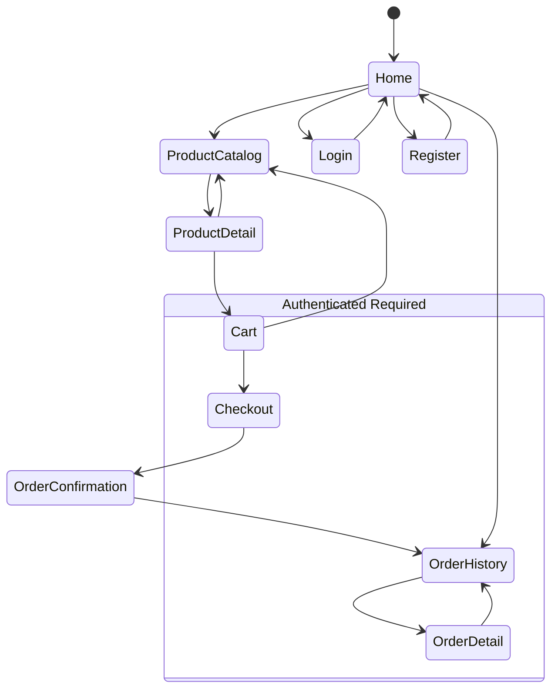
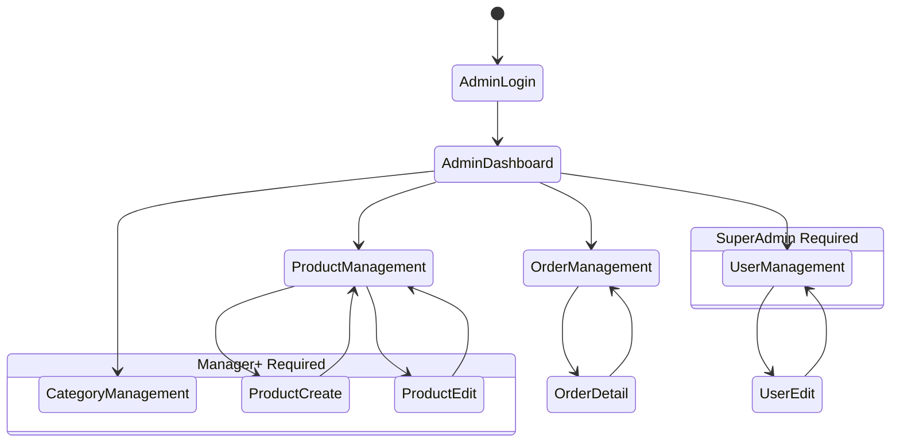

# UX Design — PC Parts E-Commerce Platform

**Version:** 1.0  
**Last Updated:** March 6, 2026  
**Related Documents:**
- [System Overview](./SYSTEM-OVERVIEW.md)
- [Technical Architecture](./TECHNICAL-ARCHITECTURE.md)

This document provides wireframes and navigation flows for all screens in the e-commerce platform.

---

## Table of Contents

1. [Navigation Flow](#navigation-flow)
2. [Customer Screens](#customer-screens)
3. [Admin Screens](#admin-screens)
4. [Shared Components](#shared-components)

---

## Navigation Flow

### Customer Journey



### Admin Journey



---

## Customer Screens

### 1. Home / Landing Page

**Route:** `/`  
**Access:** Public  
**Inspiration:** NZXT homepage with full-width hero, clean product showcase

```
┌─────────────────────────────────────────────────────────────────────────────┐
│  [LOGO]                        🔍 Search      [❤ 0] [🛒 0] [👤 Account]    │
│────────────────────────────────────────────────────────────────────────────│
│                                                                             │
│  ╔═══════════════════════════════════════════════════════════════════════╗ │
│  ║                                                                       ║ │
│  ║                                                                       ║ │
│  ║                      FULL-WIDTH HERO IMAGE                           ║ │
│  ║                   (High-end PC build showcase)                       ║ │
│  ║                                                                       ║ │
│  ║                    Build Your Dream Setup                            ║ │
│  ║              Premium PC components for every build                   ║ │
│  ║                                                                       ║ │
│  ║                  [Shop Components]  [Build PC]                       ║ │
│  ║                                                                       ║ │
│  ╚═══════════════════════════════════════════════════════════════════════╝ │
│                                                                             │
│  ─────────────────────────────────────────────────────────────────────────  │
│                                                                             │
│  Shop by Category                                                           │
│  ┌──────────────────┐  ┌──────────────────┐  ┌──────────────────┐         │
│  │                  │  │                  │  │                  │         │
│  │   Large Image    │  │   Large Image    │  │   Large Image    │         │
│  │      (CPU)       │  │      (GPU)       │  │    (Cooling)     │         │
│  │                  │  │                  │  │                  │         │
│  │   Processors     │  │  Graphics Cards  │  │   CPU Coolers    │         │
│  └──────────────────┘  └──────────────────┘  └──────────────────┘         │
│  ┌──────────────────┐  ┌──────────────────┐  ┌──────────────────┐         │
│  │   Large Image    │  │   Large Image    │  │   Large Image    │         │
│  │    (Storage)     │  │      (RAM)       │  │      (PSU)       │         │
│  │   Storage        │  │     Memory       │  │  Power Supplies  │         │
│  └──────────────────┘  └──────────────────┘  └──────────────────┘         │
│                                                                             │
│  ─────────────────────────────────────────────────────────────────────────  │
│                                                                             │
│  New Arrivals                                       [View All →]            │
│                                                                             │
│  ┌───────────────┐  ┌───────────────┐  ┌───────────────┐  ┌──────────┐   │
│  │               │  │               │  │               │  │          │   │
│  │               │  │               │  │               │  │          │   │
│  │  Product      │  │  Product      │  │  Product      │  │ Product  │   │
│  │  Image        │  │  Image        │  │  Image        │  │ Image    │   │
│  │               │  │               │  │               │  │          │   │
│  │               │  │               │  │               │  │          │   │
│  ├───────────────┤  ├───────────────┤  ├───────────────┤  ├──────────┤   │
│  │AMD Ryzen 9    │  │NVIDIA RTX     │  │Corsair Kraken │  │Samsung   │   │
│  │7900X          │  │4090           │  │360 RGB        │  │980 PRO   │   │
│  │⭐⭐⭐⭐⭐ (156)   │  │⭐⭐⭐⭐⭐ (342)   │  │⭐⭐⭐⭐⭐ (89)    │  │⭐⭐⭐⭐☆ (67)│   │
│  │$549.99        │  │$1,599.99      │  │$189.99        │  │$129.99   │   │
│  │✓ In Stock     │  │✓ In Stock     │  │✓ In Stock     │  │Low Stock │   │
│  └───────────────┘  └───────────────┘  └───────────────┘  └──────────┘   │
│                                                                             │
│  ─────────────────────────────────────────────────────────────────────────  │
│                                                                             │
│  Featured Builds                                                            │
│  ┌─────────────────────────────────────────────────────────────────────┐   │
│  │                                                                     │   │
│  │         FULL-WIDTH IMAGE (Complete PC Build Showcase)              │   │
│  │                                                                     │   │
│  │         Gaming Beast Pro                    Starting at $2,499     │   │
│  │         High-performance components for ultimate gaming            │   │
│  │         [View Components] [Build Similar]                          │   │
│  │                                                                     │   │
│  └─────────────────────────────────────────────────────────────────────┘   │
│                                                                             │
│  ─────────────────────────────────────────────────────────────────────────  │
│                                                                             │
│  Customer Reviews                                                           │
│  ┌──────────────────────────────┐  ┌──────────────────────────────┐       │
│  │ [Product Image from review]  │  │ [Product Image from review]  │       │
│  │ ⭐⭐⭐⭐⭐                         │  │ ⭐⭐⭐⭐⭐                         │       │
│  │ "Amazing performance..."      │  │ "Best upgrade ever..."       │       │
│  │ - John D.                     │  │ - Sarah M.                   │       │
│  └──────────────────────────────┘  └──────────────────────────────┘       │
│                                                                             │
│────────────────────────────────────────────────────────────────────────────│
│  Support               Community              About                        │
│  Customer Service      NZXT Club              Company                      │
│  Manage Account        Blog                   Careers                      │
│  Submit Request        Reviews                                             │
│                                                                             │
│  [FB] [TW] [IG] [YT] [TT] [RD] [DC]          © 2026 PC Parts Store        │
└─────────────────────────────────────────────────────────────────────────────┘
```

**Components:**
- **Minimal top nav:** Logo, search, wishlist badge, cart badge, account menu
- **Full-width hero banner:** Large background image, headline, CTA buttons
- **Category grid:** 6 large image cards (2 rows × 3 columns)
- **Product showcase:** Product cards with large images, ratings (stars + count), price, stock status
- **Featured builds section:** Full-width image with overlay text
- **Customer reviews:** Image-based review cards with ratings and quotes
- **Footer:** Multi-column layout with links and social icons

**Design Notes:**
- Clean, minimal aesthetic inspired by NZXT
- Large product photography as focal point
- Ratings prominently displayed on all products
- Full-width sections for modern feel
- No visible borders, uses whitespace for separation

---

### 2. Product Catalog

**Route:** `/products`  
**Access:** Public  
**Inspiration:** NZXT product grid with clean filters and large product cards

```
┌─────────────────────────────────────────────────────────────────────────────┐
│  [LOGO]                     🔍 Search Products    [❤ 0] [🛒 3] [👤 Account] │
│────────────────────────────────────────────────────────────────────────────│
│                                                                             │
│  Home > Products                                                            │
│                                                                             │
│  Processors          156 Products                         [Sort: Featured ▾]│
│                                                                             │
│  ┌──────────────┐                                                          │
│  │ Filters      │                                                          │
│  │              │  ┌────────────────┐  ┌────────────────┐  ┌────────────┐ │
│  │ Category     │  │                │  │                │  │            │ │
│  │ ● Processors │  │                │  │                │  │            │ │
│  │ ○ Graphics   │  │                │  │                │  │            │ │
│  │ ○ Memory     │  │  Large         │  │  Large         │  │  Large     │ │
│  │ ○ Storage    │  │  Product       │  │  Product       │  │  Product   │ │
│  │ ○ Cooling    │  │  Image         │  │  Image         │  │  Image     │ │
│  │              │  │                │  │                │  │            │ │
│  │ Price        │  │                │  │                │  │            │ │
│  │ $0 ───● $999 │  │                │  │                │  │            │ │
│  │              │  ├────────────────┤  ├────────────────┤  ├────────────┤ │
│  │ Brand        │  │AMD Ryzen 9     │  │Intel Core i9   │  │AMD Ryzen 7 │ │
│  │ ☑ AMD (45)   │  │7900X           │  │13900K          │  │5800X3D     │ │
│  │ ☑ Intel (38) │  │⭐⭐⭐⭐⭐ (156)    │  │⭐⭐⭐⭐☆ (89)     │  │⭐⭐⭐⭐⭐ (234) │ │
│  │ □ NVIDIA(67) │  │$549.99         │  │$589.99         │  │$449.99     │ │
│  │              │  │✓ In Stock      │  │✓ In Stock      │  │Low Stock   │ │
│  │ Availability │  │[Add to Cart]   │  │[Add to Cart]   │  │[Add to Cart│ │
│  │ ☑ In Stock   │  └────────────────┘  └────────────────┘  └────────────┘ │
│  │ □ Pre-order  │                                                          │
│  │              │  ┌────────────────┐  ┌────────────────┐  ┌────────────┐ │
│  │ [Clear All]  │  │  Large         │  │  Large         │  │  Large     │ │
│  │              │  │  Product       │  │  Product       │  │  Product   │ │
│  └──────────────┘  │  Image         │  │  Image         │  │  Image     │ │
│                    │                │  │                │  │            │ │
│                    │AMD Ryzen 9     │  │Intel i7        │  │AMD Ryzen 5 │ │
│                    │7950X           │  │13700K          │  │7600X       │ │
│                    │⭐⭐⭐⭐⭐ (412)    │  │⭐⭐⭐⭐⭐ (167)    │  │⭐⭐⭐⭐☆ (92)  │ │
│                    │$699.99         │  │$419.99         │  │$299.99     │ │
│                    │✓ In Stock      │  │✓ In Stock      │  │✓ In Stock  │ │
│                    │[Add to Cart]   │  │[Add to Cart]   │  │[Add to Cart│ │
│                    └────────────────┘  └────────────────┘  └────────────┘ │
│                                                                             │
│                              [Load More Products]                           │
│                                                                             │
└─────────────────────────────────────────────────────────────────────────────┘
```

**Components:**
- **Top nav:** Logo, search, wishlist, cart, account
- **Breadcrumb:** Navigation trail
- **Page header:** Category name, count, sort dropdown
- **Sidebar filters (collapsible):**
  - Category radio buttons
  - Price range slider
  - Brand checkboxes with counts
  - Availability toggles
  - Clear all button
- **Product grid:** 3 columns (responsive to 4 on large screens)
- **Product cards:**
  - Large product image (primary focus)
  - Product name
  - Star rating + review count
  - Price
  - Stock status badge
  - "Add to Cart" button
- **Infinite scroll or "Load More" button**

**Design Notes:**
- Larger product images (NZXT style)
- Minimal borders, clean whitespace
- Ratings prominently displayed
- Filters are subtle but functional

**Query Parameters:**
- `?page=1&limit=20`
- `&category=uuid`
- `&minPrice=0&maxPrice=999`
- `&brand=AMD,Intel`
- `&inStock=true`
- `&sort=featured|price:asc|price:desc|rating`

---

### 3. Product Detail

**Route:** `/products/:id`  
**Access:** Public  
**Inspiration:** NZXT product pages with large image gallery and clean layout

```
┌─────────────────────────────────────────────────────────────────────────────┐
│  [LOGO]                        🔍 Search      [❤ 12] [🛒 3] [👤 Account]   │
│────────────────────────────────────────────────────────────────────────────│
│                                                                             │
│  Home > Processors > AMD Ryzen 9 7900X                                     │
│                                                                             │
│  ┌────────────────────────────────────────┐                                │
│  │                                        │  AMD Ryzen 9 7900X              │
│  │                                        │  ⭐⭐⭐⭐⭐ 4.8 (156 reviews)        │
│  │                                        │                                 │
│  │                                        │  $549.99                        │
│  │                                        │  ✓ In Stock                     │
│  │          Large Main                   │                                 │
│  │          Product Image                │  High-performance 12-core,      │
│  │          (Zoomable)                   │  24-thread processor for        │
│  │                                        │  gaming and content creation    │
│  │                                        │                                 │
│  │                                        │  Quantity                       │
│  │                                        │  [  -  ]  1  [  +  ]           │
│  └────────────────────────────────────────┘                                │
│  [Thumb1] [Thumb2] [Thumb3] [Thumb4]       [Add to Cart]  [♥ Add to       │
│                                                            Wishlist]        │
│                                                                             │
│  ─────────────────────────────────────────────────────────────────────────  │
│                                                                             │
│  Specifications                    Details                                  │
│  ┌──────────────────────┐         ┌──────────────────────────────┐        │
│  │ Cores       12       │         │ SKU: AMD-7900X-001           │        │
│  │ Threads     24       │         │ Brand: AMD                   │        │
│  │ Base Clock  4.7 GHz  │         │ Category: Processors         │        │
│  │ Boost Clock 5.4 GHz  │         │ Model: Ryzen 9 7900X        │        │
│  │ Socket      AM5      │         │ Warranty: 3 Years            │        │
│  │ TDP         170W     │         │                              │        │
│  │ Cache       64MB L3  │         │ Free shipping on orders      │        │
│  │ Process     5nm      │         │ over $50                     │        │
│  └──────────────────────┘         └──────────────────────────────┘        │
│                                                                             │
│  ─────────────────────────────────────────────────────────────────────────  │
│                                                                             │
│  Customer Reviews                                         [Write a Review]  │
│                                                                             │
│  ⭐⭐⭐⭐⭐ 4.8 out of 5                                                         │
│  156 reviews                                                                │
│                                                                             │
│  ┌─────────────────────────────────────────────────────────────────────┐   │
│  │ ⭐⭐⭐⭐⭐  "Amazing performance!"                                         │   │
│  │                                                                     │   │
│  │ Upgraded from an older Intel processor and the difference is       │   │
│  │ incredible. Handles everything I throw at it.                      │   │
│  │                                                                     │   │
│  │ [Customer build photo]                                             │   │
│  │                                                                     │   │
│  │ John D. - Verified Purchase - 2 weeks ago                          │   │
│  │ Was this helpful? 👍 42  👎 1                                        │   │
│  └─────────────────────────────────────────────────────────────────────┘   │
│                                                                             │
│  ┌─────────────────────────────────────────────────────────────────────┐   │
│  │ ⭐⭐⭐⭐⭐  "Best CPU for gaming"                                         │   │
│  │                                                                     │   │
│  │ Running this with an RTX 4090 and getting amazing frame rates.     │   │
│  │ Temps stay cool even under heavy load.                             │   │
│  │                                                                     │   │
│  │ Sarah M. - Verified Purchase - 1 month ago                         │   │
│  │ Was this helpful? 👍 38  👎 2                                        │   │
│  └─────────────────────────────────────────────────────────────────────┘   │
│                                                                             │
│                              [Load More Reviews]                            │
│                                                                             │
│  ─────────────────────────────────────────────────────────────────────────  │
│                                                                             │
│  You May Also Like                                      [View All →]        │
│  ┌────────────────┐  ┌────────────────┐  ┌────────────────┐              │
│  │ Large Image    │  │ Large Image    │  │ Large Image    │              │
│  │ Intel i9-13900K│  │ AMD R7 5800X3D │  │ AMD R9 7950X   │              │
│  │ ⭐⭐⭐⭐☆ (89)     │  │ ⭐⭐⭐⭐⭐ (234)    │  │ ⭐⭐⭐⭐⭐ (412)    │              │
│  │ $589.99        │  │ $449.99        │  │ $699.99        │              │
│  └────────────────┘  └────────────────┘  └────────────────┘              │
│                                                                             │
└─────────────────────────────────────────────────────────────────────────────┘
```

**Components:**
- **Breadcrumb navigation**
- **Product gallery:**
  - Large main image (zoomable on hover/click)
  - Thumbnail strip below
- **Product info sidebar:**
  - Product name
  - Star rating + average + review count
  - Price
  - Stock status
  - Short description
  - Quantity selector
  - "Add to Cart" (primary) and "Add to Wishlist" (secondary) buttons
- **Specifications grid:** Key specs in clean 2-column layout
- **Product details:** SKU, brand, category, warranty, shipping info
- **Customer reviews section:**
  - Overall rating summary
  - Individual review cards with photos
  - Verified purchase badges
  - Helpful votes
  - "Write a Review" CTA
- **Related products:** Large image cards with ratings

**Design Notes:**
- Large, high-quality product photography
- Clean, spacious layout
- Reviews with customer photos (NZXT style)
- Minimal text, visual focus
- Key specs at a glance

---

### 4. Shopping Cart

**Route:** `/cart`  
**Access:** Authenticated (Customer)  
**Inspiration:** NZXT clean cart with large product images

```
┌─────────────────────────────────────────────────────────────────────────────┐
│  [LOGO]                        🔍 Search      [❤ 12] [🛒 3] [👤 Account]   │
│────────────────────────────────────────────────────────────────────────────│
│                                                                             │
│  Home > Cart                                                                │
│                                                                             │
│  Your Cart (3 items)                              [← Continue Shopping]     │
│                                                                             │
│  ┌──────────────────────────────────────────────────┐  ┌────────────────┐ │
│  │                                                  │  │ Order Summary  │ │
│  │  ┌────────┐                                      │  │                │ │
│  │  │        │  AMD Ryzen 9 7900X                   │  │ Subtotal       │ │
│  │  │ Large  │  $549.99                             │  │ $2,549.96      │ │
│  │  │ Product│  ✓ In Stock                          │  │                │ │
│  │  │ Image  │                                      │  │ Shipping       │ │
│  │  │        │  Qty: [  -  ]  1  [  +  ]           │  │ FREE           │ │
│  │  └────────┘                                      │  │                │ │
│  │             $549.99         [♥ Save] [× Remove]  │  │ Tax            │ │
│  │                                                  │  │ Calculated at  │ │
│  │  ─────────────────────────────────────────────  │  │ checkout       │ │
│  │                                                  │  │                │ │
│  │  ┌────────┐                                      │  │ ─────────────  │ │
│  │  │        │  NVIDIA GeForce RTX 4090             │  │                │ │
│  │  │ Large  │  $1,599.99                           │  │ Total          │ │
│  │  │ Product│  ✓ In Stock                          │  │ $2,549.96      │ │
│  │  │ Image  │                                      │  │                │ │
│  │  │        │  Qty: [  -  ]  1  [  +  ]           │  │                │ │
│  │  └────────┘                                      │  │ [  Checkout  ] │ │
│  │             $1,599.99       [♥ Save] [× Remove]  │  │                │ │
│  │                                                  │  │ Accepted       │ │
│  │  ─────────────────────────────────────────────  │  │ 💳 Visa        │ │
│  │                                                  │  │ 💳 Mastercard  │ │
│  │  ┌────────┐                                      │  │ 💳 Amex        │ │
│  │  │        │  Corsair Vengeance DDR5 32GB         │  │ 💳 PayPal      │ │
│  │  │ Large  │  $199.99                             │  │                │ │
│  │  │ Product│  ✓ In Stock                          │  └────────────────┘ │
│  │  │ Image  │                                      │                     │
│  │  │        │  Qty: [  -  ]  2  [  +  ]           │                     │
│  │  └────────┘                                      │                     │
│  │             $399.98         [♥ Save] [× Remove]  │                     │
│  │                                                  │                     │
│  └──────────────────────────────────────────────────┘                     │
│                                                                             │
│  ─────────────────────────────────────────────────────────────────────────  │
│                                                                             │
│  You May Also Like                                                          │
│  ┌────────────────┐  ┌────────────────┐  ┌────────────────┐              │
│  │ Large Image    │  │ Large Image    │  │ Large Image    │              │
│  │ Product        │  │ Product        │  │ Product        │              │
│  │ $XX.XX         │  │ $XX.XX         │  │ $XX.XX         │              │
│  └────────────────┘  └────────────────┘  └────────────────┘              │
│                                                                             │
└─────────────────────────────────────────────────────────────────────────────┘
```

**Components:**
- **Cart items list:**
  - Large product thumbnail (square format)
  - Product name
  - Unit price
  - Stock status
  - Quantity selector (larger, more spacious)
  - Line total
  - "Save for Later" and "Remove" actions
  - Clean separation between items
- **Order summary sidebar:**
  - Subtotal
  - Shipping (FREE over $50)
  - Tax note
  - Total (prominent)
  - Large "Checkout" button
  - Accepted payment methods icons
- **Recommendations:** "You May Also Like" section
- **Empty state:** Friendly message with "Browse Products" CTA

**Design Notes:**
- Large product images (consistent with NZXT)
- Spacious layout with clear hierarchy
- Subtle "Save for Later" (moves to wishlist)
- Clean, minimal styling
- Focus on product visuals

**Warnings:**
- Real-time stock validation
- Price change notifications
- Quantity limit warnings

---

### 5. Checkout

**Route:** `/checkout`  
**Access:** Authenticated (Customer)

```
┌────────────────────────────────────────────────────────────────────┐
│  [Logo]                                                   [User▾]  │
│  Home > Cart > Checkout                                             │
├────────────────────────────────────────────────────────────────────┤
│                                                                     │
│  Checkout                                     🔒 Secure Checkout   │
│                                                                     │
│  ┌────────────────────────────┐  ┌──────────────────────────────┐ │
│  │ 1. Shipping Address        │  │  Order Summary               │ │
│  │ ─────────────────────      │  │  ──────────────              │ │
│  │                            │  │  3 items                     │ │
│  │ ○ John Doe                 │  │                              │ │
│  │   123 Main Street          │  │  AMD Ryzen 9 7900X      x1   │ │
│  │   Apt 4B                   │  │  $549.99                     │ │
│  │   New York, NY 10001       │  │                              │ │
│  │   United States            │  │  NVIDIA RTX 4090        x1   │ │
│  │   [Edit]                   │  │  $1,599.99                   │ │
│  │                            │  │                              │ │
│  │ ● Sarah Smith              │  │  Corsair DDR5 32GB      x2   │ │
│  │   456 Oak Avenue           │  │  $399.98                     │ │
│  │   Brooklyn, NY 11201       │  │                              │ │
│  │   United States            │  │  ────────────────────────    │ │
│  │   [Edit]                   │  │  Subtotal:       $2,549.96   │ │
│  │                            │  │  Shipping:           $9.99   │ │
│  │ [+ Add New Address]        │  │  Tax:              $229.50   │ │
│  │                            │  │  ────────────────────────    │ │
│  │ [Continue]                 │  │  Total:          $2,789.45   │ │
│  └────────────────────────────┘  │                              │ │
│                                   │  [Place Order]               │ │
│  ┌────────────────────────────┐  └──────────────────────────────┘ │
│  │ 2. Payment (Mock)          │                                   │
│  │ ─────────────────────      │                                   │
│  │                            │                                   │
│  │ ● Credit Card              │                                   │
│  │   💳 **** **** **** 4242   │                                   │
│  │                            │                                   │
│  │ ○ PayPal                   │                                   │
│  │                            │                                   │
│  │ Note: This is a mock       │                                   │
│  │ payment for academic       │                                   │
│  │ purposes                   │                                   │
│  │                            │                                   │
│  │ [Continue]                 │                                   │
│  └────────────────────────────┘                                   │
│                                                                     │
└────────────────────────────────────────────────────────────────────┘
```

**Components:**
- Step indicator (optional)
- Shipping address section:
  - Radio button list of saved addresses
  - "Edit" and "Add New" buttons
  - Selected address highlighted
- Payment section:
  - Mock payment options (radio buttons)
  - Disclaimer about academic project
- Order summary sidebar:
  - List of items with quantities
  - Cost breakdown (subtotal, shipping, tax, total)
  - "Place Order" button (disabled until all steps complete)

**Flow:**
1. Select shipping address (or add new)
2. Select payment method (mock)
3. Review order
4. Place order → redirect to confirmation

---

### 6. Order Confirmation

**Route:** `/orders/:id/confirmation`  
**Access:** Authenticated (Customer)

```
┌────────────────────────────────────────────────────────────────────┐
│  [Logo]                                                   [User▾]  │
│  Home > Orders > ORD-20260306-001                                  │
├────────────────────────────────────────────────────────────────────┤
│                                                                     │
│                  ✓ Order Placed Successfully!                      │
│                                                                     │
│              Order Number: ORD-20260306-001                        │
│              Estimated Delivery: March 13, 2026                    │
│                                                                     │
│  ──────────────────────────────────────────────────────────────── │
│                                                                     │
│  Order Details                                                      │
│                                                                     │
│  ┌──────────────────────────────────────────────────────────────┐ │
│  │ AMD Ryzen 9 7900X               x1              $549.99      │ │
│  │ NVIDIA RTX 4090                 x1            $1,599.99      │ │
│  │ Corsair DDR5 32GB               x2              $399.98      │ │
│  │                                                               │ │
│  │ Subtotal:                                     $2,549.96      │ │
│  │ Shipping:                                         $9.99      │ │
│  │ Tax:                                            $229.50      │ │
│  │ ────────────────────────────────────────────────────────      │ │
│  │ Total:                                        $2,789.45      │ │
│  └──────────────────────────────────────────────────────────────┘ │
│                                                                     │
│  Shipping Address                                                  │
│  Sarah Smith                                                       │
│  456 Oak Avenue                                                    │
│  Brooklyn, NY 11201                                                │
│  United States                                                     │
│                                                                     │
│  Payment Method                                                    │
│  Credit Card ending in 4242                                        │
│                                                                     │
│              [View Order Details]    [Continue Shopping]           │
│                                                                     │
│  ──────────────────────────────────────────────────────────────── │
│                                                                     │
│  What's Next?                                                      │
│  • You'll receive an email confirmation shortly                    │
│  • Track your order status in Order History                       │
│  • We'll notify you when your order ships                         │
│                                                                     │
└────────────────────────────────────────────────────────────────────┘
```

**Components:**
- Success icon and message
- Order number (prominent)
- Estimated delivery date
- Order summary:
  - Line items with quantities
  - Cost breakdown
- Shipping address
- Payment method (masked)
- Action buttons:
  - "View Order Details" (go to order detail page)
  - "Continue Shopping" (back to catalog)
- What's next section (expectations)

---

### 7. Order History

**Route:** `/orders`  
**Access:** Authenticated (Customer)

```
┌────────────────────────────────────────────────────────────────────┐
│  [Logo]                                        [Cart: 0]   [User▾] │
│  Home > My Orders                                                   │
├────────────────────────────────────────────────────────────────────┤
│                                                                     │
│  My Orders                                                          │
│                                                                     │
│  ┌──────────────────────────────────────────────────────────────┐ │
│  │ Order #ORD-20260306-001                      March 6, 2026   │ │
│  │ Total: $2,789.45                             🟢 Processing   │ │
│  │ 3 items                                                       │ │
│  │ AMD Ryzen 9 7900X, NVIDIA RTX 4090, Corsair DDR5 32GB       │ │
│  │                                              [View Details]   │ │
│  └──────────────────────────────────────────────────────────────┘ │
│                                                                     │
│  ┌──────────────────────────────────────────────────────────────┐ │
│  │ Order #ORD-20260301-042                      March 1, 2026   │ │
│  │ Total: $599.99                               📦 Shipped      │ │
│  │ 2 items                                                       │ │
│  │ Corsair RM850x PSU, Samsung 980 PRO 1TB                     │ │
│  │                                [Track]       [View Details]   │ │
│  └──────────────────────────────────────────────────────────────┘ │
│                                                                     │
│  ┌──────────────────────────────────────────────────────────────┐ │
│  │ Order #ORD-20260215-089                      Feb 15, 2026    │ │
│  │ Total: $1,199.99                             ✓ Delivered     │ │
│  │ 1 item                                                        │ │
│  │ ASUS ROG Strix B650E Motherboard                            │ │
│  │                                              [View Details]   │ │
│  └──────────────────────────────────────────────────────────────┘ │
│                                                                     │
│  [Load More Orders]                                                │
│                                                                     │
└────────────────────────────────────────────────────────────────────┘
```

**Components:**
- Order list (cards):
  - Order number and date
  - Total amount
  - Status badge with color coding:
    - 🟡 Pending Payment
    - 🟢 Processing / Preparing
    - 📦 Shipped
    - ✓ Delivered
    - ❌ Cancelled
  - Item count and preview (first few items)
  - "View Details" button
  - "Track" button (for shipped orders)
- Pagination or infinite scroll
- Empty state (if no orders)

**Status Colors:**
- Yellow: Pending Payment
- Blue/Green: Payment Confirmed, Processing, Preparing
- Purple: Shipped
- Green: Delivered
- Red: Cancelled

---

### 8. Order Detail

**Route:** `/orders/:id`  
**Access:** Authenticated (Customer, or Staff/Manager for all orders)

```
┌────────────────────────────────────────────────────────────────────┐
│  [Logo]                                                   [User▾]  │
│  Home > My Orders > ORD-20260306-001                               │
├────────────────────────────────────────────────────────────────────┤
│                                                                     │
│  Order #ORD-20260306-001                      🟢 Processing        │
│  Placed on: March 6, 2026, 2:30 PM                                │
│                                                    [Cancel Order]   │
│                                                                     │
│  ──────────────────────────────────────────────────────────────── │
│                                                                     │
│  Order Status Timeline                                             │
│  ●────●────●────○────○────○                                        │
│  Placed  Paid  Processing  Preparing  Shipped  Delivered           │
│                                                                     │
│  ──────────────────────────────────────────────────────────────── │
│                                                                     │
│  Order Items                                                        │
│  ┌──────────────────────────────────────────────────────────────┐ │
│  │ ┌────┐  AMD Ryzen 9 7900X                                    │ │
│  │ │Img │  SKU: AMD-7900X-001                                   │ │
│  │ └────┘  Qty: 1                                    $549.99    │ │
│  ├──────────────────────────────────────────────────────────────┤ │
│  │ ┌────┐  NVIDIA RTX 4090                                      │ │
│  │ │Img │  SKU: NV-4090-FE                                      │ │
│  │ └────┘  Qty: 1                                  $1,599.99    │ │
│  ├──────────────────────────────────────────────────────────────┤ │
│  │ ┌────┐  Corsair DDR5 32GB                                    │ │
│  │ │Img │  SKU: COR-DDR5-32                                     │ │
│  │ └────┘  Qty: 2                                    $399.98    │ │
│  └──────────────────────────────────────────────────────────────┘ │
│                                                                     │
│  Order Summary                                                      │
│  Subtotal:                                            $2,549.96    │
│  Shipping:                                                $9.99    │
│  Tax:                                                   $229.50    │
│  ──────────────────────────────────────────────────────────────   │
│  Total:                                               $2,789.45    │
│                                                                     │
│  Shipping Address                Payment Method                    │
│  Sarah Smith                     Credit Card ending in 4242        │
│  456 Oak Avenue                                                    │
│  Brooklyn, NY 11201                                                │
│  United States                                                     │
│                                                                     │
│  Status History                                                    │
│  ┌──────────────────────────────────────────────────────────────┐ │
│  │ Processing          March 6, 2026, 2:32 PM                   │ │
│  │ Payment Confirmed   March 6, 2026, 2:31 PM                   │ │
│  │ Pending Payment     March 6, 2026, 2:30 PM                   │ │
│  └──────────────────────────────────────────────────────────────┘ │
│                                                                     │
└────────────────────────────────────────────────────────────────────┘
```

**Components:**
- Order header:
  - Order number and status badge
  - Placed date/time
  - "Cancel Order" button (only for Pending Payment status)
- Order status timeline (visual progress)
- Order items list (read-only)
- Order summary (costs)
- Shipping address and payment method
- Status history (reverse chronological)

---

### 9. Login

**Route:** `/auth/login`  
**Access:** Public

```
┌────────────────────────────────────────────────────────────────────┐
│  [Logo]      PC Parts Store                                        │
│  Home  |  Catalog  |  About                                        │
├────────────────────────────────────────────────────────────────────┤
│                                                                     │
│                                                                     │
│              ┌─────────────────────────────────┐                   │
│              │                                 │                   │
│              │   Login to Your Account         │                   │
│              │                                 │                   │
│              │   Email:                        │                   │
│              │   [___________________________] │                   │
│              │                                 │                   │
│              │   Password:                     │                   │
│              │   [___________________________] │                   │
│              │   □ Remember me                 │                   │
│              │                                 │                   │
│              │   [Forgot Password?]            │                   │
│              │                                 │                   │
│              │   [         Login         ]     │                   │
│              │                                 │                   │
│              │   Don't have an account?        │                   │
│              │   [Register Here]               │                   │
│              │                                 │                   │
│              └─────────────────────────────────┘                   │
│                                                                     │
│                                                                     │
└────────────────────────────────────────────────────────────────────┘
```

**Components:**
- Centered login form card:
  - Email input (with validation)
  - Password input (with show/hide toggle)
  - "Remember me" checkbox
  - "Forgot Password?" link
  - "Login" button
  - "Register Here" link
- Error message display (above form)
- Loading state for button

---

### 10. Register

**Route:** `/auth/register`  
**Access:** Public

```
┌────────────────────────────────────────────────────────────────────┐
│  [Logo]      PC Parts Store                                        │
│  Home  |  Catalog  |  About                                        │
├────────────────────────────────────────────────────────────────────┤
│                                                                     │
│              ┌─────────────────────────────────┐                   │
│              │                                 │                   │
│              │   Create Your Account           │                   │
│              │                                 │                   │
│              │   First Name:                   │                   │
│              │   [___________________________] │                   │
│              │                                 │                   │
│              │   Last Name:                    │                   │
│              │   [___________________________] │                   │
│              │                                 │                   │
│              │   Email:                        │                   │
│              │   [___________________________] │                   │
│              │                                 │                   │
│              │   Phone:                        │                   │
│              │   [___________________________] │                   │
│              │                                 │                   │
│              │   Password:                     │                   │
│              │   [___________________________] │                   │
│              │   At least 8 characters         │                   │
│              │                                 │                   │
│              │   Confirm Password:             │                   │
│              │   [___________________________] │                   │
│              │                                 │                   │
│              │   ☑ I agree to Terms of Service│                   │
│              │                                 │                   │
│              │   [       Register        ]     │                   │
│              │                                 │                   │
│              │   Already have an account?      │                   │
│              │   [Login Here]                  │                   │
│              │                                 │                   │
│              └─────────────────────────────────┘                   │
│                                                                     │
└────────────────────────────────────────────────────────────────────┘
```

**Components:**
- Centered registration form card:
  - First name input
  - Last name input
  - Email input (with validation)
  - Phone input (optional)
  - Password input (with strength indicator)
  - Confirm password input
  - Terms of service checkbox
  - "Register" button
  - "Login Here" link (for existing users)
- Validation messages (inline)
- Password strength indicator

---

## Admin Screens

### 11. Admin Dashboard

**Route:** `/admin/dashboard`  
**Access:** Staff, Manager, SuperAdmin

```
┌────────────────────────────────────────────────────────────────────┐
│  [Logo]  Admin Panel                                 [Admin User▾] │
│  Dashboard | Products | Orders | Users | Categories                │
├────────────────────────────────────────────────────────────────────┤
│                                                                     │
│  Dashboard                                                          │
│                                                                     │
│  ┌────────────┐  ┌────────────┐  ┌────────────┐  ┌────────────┐  │
│  │📦 Products │  │📋 Orders   │  │👥 Users    │  │💰 Revenue  │  │
│  │            │  │            │  │            │  │            │  │
│  │    245     │  │    1,234   │  │    567     │  │  $125,430  │  │
│  │  In Stock  │  │  Pending: 23│  │  Active: 542│ │ This Month │  │
│  └────────────┘  └────────────┘  └────────────┘  └────────────┘  │
│                                                                     │
│  Recent Orders                                                      │
│  ┌──────────────────────────────────────────────────────────────┐ │
│  │ Order #         Customer       Status        Total      Action│ │
│  ├──────────────────────────────────────────────────────────────┤ │
│  │ ORD-001         John Doe       🟢 Processing  $2,789   [View]│ │
│  │ ORD-002         Jane Smith     🟡 Pending     $1,234   [View]│ │
│  │ ORD-003         Bob Johnson    📦 Shipped     $3,456   [View]│ │
│  │ ORD-004         Alice Brown    ✓ Delivered    $789    [View]│ │
│  │ ORD-005         Charlie Lee    🟢 Processing  $4,567   [View]│ │
│  └──────────────────────────────────────────────────────────────┘ │
│                                                   [View All Orders]│
│                                                                     │
│  Low Stock Alert                                                   │
│  ┌──────────────────────────────────────────────────────────────┐ │
│  │ Product                         Current Stock      Action     │ │
│  ├──────────────────────────────────────────────────────────────┤ │
│  │ AMD Ryzen 9 7900X               3 units            [Restock] │ │
│  │ Corsair RM850x PSU              1 unit             [Restock] │ │
│  │ Samsung 980 PRO 1TB             5 units            [Restock] │ │
│  └──────────────────────────────────────────────────────────────┘ │
│                                                                     │
└────────────────────────────────────────────────────────────────────┘
```

**Components:**
- Admin navigation (top bar)
- Statistics cards:
  - Total products in stock
  - Order count + pending count
  - Active users count
  - Revenue (month-to-date)
- Recent orders table (5-10 most recent)
- Low stock alert table (products below threshold)
- Quick action buttons

**Role-specific visibility:**
- **Staff:** See orders only
- **Manager:** See all stats, can manage products
- **SuperAdmin:** See everything including users

---

### 12. Admin Product Management

**Route:** `/admin/products`  
**Access:** Manager, SuperAdmin

```
┌────────────────────────────────────────────────────────────────────┐
│  [Logo]  Admin Panel                                 [Admin User▾] │
│  Dashboard | Products | Orders | Users | Categories                │
├────────────────────────────────────────────────────────────────────┤
│                                                                     │
│  Product Management                               [+ Add Product]  │
│                                                                     │
│  🔍 [Search products...]    [Category ▾]  [Status ▾]  [Sort ▾]    │
│                                                                     │
│  ┌──────────────────────────────────────────────────────────────┐ │
│  │ Thumbnail    Product         SKU        Price   Stock  Status │ │
│  ├──────────────────────────────────────────────────────────────┤ │
│  │ [IMG] AMD Ryzen 9 7900X   AMD-7900X  $549.99   23   ✓ Active │ │
│  │                                              [Edit]  [Delete]  │ │
│  ├──────────────────────────────────────────────────────────────┤ │
│  │ [IMG] NVIDIA RTX 4090     NV-4090-FE  $1,599   42   ✓ Active │ │
│  │                                              [Edit]  [Delete]  │ │
│  ├──────────────────────────────────────────────────────────────┤ │
│  │ [IMG] Intel i9-13900K     INT-13900K $589.99   15   ✓ Active │ │
│  │                                              [Edit]  [Delete]  │ │
│  ├──────────────────────────────────────────────────────────────┤ │
│  │ [IMG] Corsair DDR5 32GB   COR-DDR5    $199.99    8   ✓ Active │ │
│  │                                              [Edit]  [Delete]  │ │
│  ├──────────────────────────────────────────────────────────────┤ │
│  │ [IMG] Samsung 980 PRO     SAM-980PRO  $129.99    5  ⚠ Low    │ │
│  │                                              [Edit]  [Delete]  │ │
│  └──────────────────────────────────────────────────────────────┘ │
│                                                                     │
│  [< Previous]  Page 1 of 13  [Next >]                              │
│                                                                     │
└────────────────────────────────────────────────────────────────────┘
```

**Components:**
- "Add Product" button (top right)
- Search and filter bar:
  - Search input
  - Category dropdown
  - Status filter (Active/Inactive)
  - Sort options
- Product table:
  - Thumbnail image
  - Product name
  - SKU
  - Price
  - Stock (with low stock indicator)
  - Status badge
  - Actions: Edit, Delete (with confirmation)
- Pagination

---

### 13. Admin Product Create/Edit

**Route:** `/admin/products/new` or `/admin/products/:id/edit`  
**Access:** Manager, SuperAdmin

```
┌────────────────────────────────────────────────────────────────────┐
│  [Logo]  Admin Panel                                 [Admin User▾] │
│  Dashboard | Products | Orders | Users | Categories                │
├────────────────────────────────────────────────────────────────────┤
│                                                                     │
│  Product Management > Add New Product                              │
│                                                [Cancel]  [Save]     │
│                                                                     │
│  ┌──────────────────────────────────────────────────────────────┐ │
│  │ Basic Information                                             │ │
│  │ ─────────────────                                             │ │
│  │                                                               │ │
│  │ Product Name: *                                               │ │
│  │ [___________________________________________________________] │ │
│  │                                                               │ │
│  │ SKU: *                      Category: *                       │ │
│  │ [_______________________]   [CPUs ▾________________________]  │ │
│  │                                                               │ │
│  │ Brand:                      Model:                            │ │
│  │ [_______________________]   [_____________________________]  │ │
│  │                                                               │ │
│  │ Description:                                                  │ │
│  │ [___________________________________________________________] │ │
│  │ [___________________________________________________________] │ │
│  │ [___________________________________________________________] │ │
│  │                                                               │ │
│  └──────────────────────────────────────────────────────────────┘ │
│                                                                     │
│  ┌──────────────────────────────────────────────────────────────┐ │
│  │ Pricing & Inventory                                           │ │
│  │ ───────────────────                                           │ │
│  │                                                               │ │
│  │ Price (USD): *              Stock Quantity: *                 │ │
│  │ [_______________________]   [_____________________________]  │ │
│  │                                                               │ │
│  │ Status: *                                                     │ │
│  │ ● Active    ○ Inactive                                        │ │
│  │                                                               │ │
│  └──────────────────────────────────────────────────────────────┘ │
│                                                                     │
│  ┌──────────────────────────────────────────────────────────────┐ │
│  │ Specifications (JSON)                                         │ │
│  │ ─────────────────────                                         │ │
│  │                                                               │ │
│  │ [+ Add Specification]                                         │ │
│  │                                                               │ │
│  │ Cores:        [12____________________]           [Remove]     │ │
│  │ Threads:      [24____________________]           [Remove]     │ │
│  │ Base Clock:   [4.7 GHz_______________]           [Remove]     │ │
│  │ Boost Clock:  [5.4 GHz_______________]           [Remove]     │ │
│  │ Socket:       [AM5___________________]           [Remove]     │ │
│  │                                                               │ │
│  └──────────────────────────────────────────────────────────────┘ │
│                                                                     │
│  ┌──────────────────────────────────────────────────────────────┐ │
│  │ Product Images                                                │ │
│  │ ──────────────                                                │ │
│  │                                                               │ │
│  │ [Upload Images] (Max 5 images)                                │ │
│  │                                                               │ │
│  │ [Img1] [Img2] [Img3] [Img4] [Img5]                            │ │
│  │ Main   [↑][↓] [↑][↓] [↑][↓] [↑][↓]  (set display order)     │ │
│  │ [×]    [×]    [×]    [×]    [×]     (remove image)           │ │
│  │                                                               │ │
│  └──────────────────────────────────────────────────────────────┘ │
│                                                                     │
│                                        [Cancel]  [Save Product]    │
│                                                                     │
└────────────────────────────────────────────────────────────────────┘
```

**Components:**
- Form sections (collapsible cards):
  1. **Basic Information:**
     - Product name (required)
     - SKU (required, unique)
     - Category dropdown (required)
     - Brand
     - Model
     - Description (textarea)
  2. **Pricing & Inventory:**
     - Price input (required, in dollars)
     - Stock quantity (required)
     - Status radio buttons (Active/Inactive)
  3. **Specifications:**
     - Dynamic key-value pairs
     - "Add Specification" button
     - Remove buttons for each pair
  4. **Product Images:**
     - File upload (max 5 images)
     - Image preview thumbnails
     - Display order controls (up/down arrows)
     - Remove buttons
     - Primary image indicator
- Action buttons:
  - "Cancel" (navigate back)
  - "Save Product" (validate and submit)
- Validation messages (inline)

---

### 14. Admin Order Management

**Route:** `/admin/orders`  
**Access:** Staff, Manager, SuperAdmin

```
┌────────────────────────────────────────────────────────────────────┐
│  [Logo]  Admin Panel                                 [Admin User▾] │
│  Dashboard | Products | Orders | Users | Categories                │
├────────────────────────────────────────────────────────────────────┤
│                                                                     │
│  Order Management                                                  │
│                                                                     │
│  🔍 [Search orders...]  [Status: All ▾]  [Date Range]  [Export]   │
│                                                                     │
│  ┌──────────────────────────────────────────────────────────────┐ │
│  │ Order #      Date       Customer      Status      Total Action│ │
│  ├──────────────────────────────────────────────────────────────┤ │
│  │ ORD-001   Mar 6, 2026  John Doe      🟢 Processing $2,789    │ │
│  │                                                      [View]    │ │
│  ├──────────────────────────────────────────────────────────────┤ │
│  │ ORD-002   Mar 6, 2026  Jane Smith    🟡 Pending    $1,234    │ │
│  │                                                      [View]    │ │
│  ├──────────────────────────────────────────────────────────────┤ │
│  │ ORD-003   Mar 5, 2026  Bob Johnson   📦 Shipped    $3,456    │ │
│  │                                                      [View]    │ │
│  ├──────────────────────────────────────────────────────────────┤ │
│  │ ORD-004   Mar 5, 2026  Alice Brown   ✓ Delivered   $789     │ │
│  │                                                      [View]    │ │
│  ├──────────────────────────────────────────────────────────────┤ │
│  │ ORD-005   Mar 4, 2026  Charlie Lee   ❌ Cancelled   $4,567    │ │
│  │                                                      [View]    │ │
│  └──────────────────────────────────────────────────────────────┘ │
│                                                                     │
│  [< Previous]  Page 1 of 62  [Next >]                              │
│                                                                     │
│  Quick Stats:                                                      │
│  Pending Payment: 23  |  Processing: 45  |  Shipped: 89          │
│                                                                     │
└────────────────────────────────────────────────────────────────────┘
```

**Components:**
- Search and filter bar:
  - Search by order number, customer name
  - Status filter dropdown (All, Pending, Processing, Shipped, Delivered, Cancelled)
  - Date range picker
  - "Export" button (CSV)
- Orders table:
  - Order number
  - Date
  - Customer name
  - Status badge with color
  - Total amount
  - "View" button (opens order detail)
- Pagination
- Quick stats (count by status)

---

### 15. Admin Order Detail

**Route:** `/admin/orders/:id`  
**Access:** Staff, Manager, SuperAdmin

```
┌────────────────────────────────────────────────────────────────────┐
│  [Logo]  Admin Panel                                 [Admin User▾] │
│  Dashboard | Products | Orders | Users | Categories                │
├────────────────────────────────────────────────────────────────────┤
│                                                                     │
│  Order Management > ORD-20260306-001                  [← Back]     │
│                                                                     │
│  Order #ORD-20260306-001                      🟢 Processing        │
│  Placed: March 6, 2026, 2:30 PM                                    │
│  Customer: John Doe (john.doe@example.com)                         │
│                                                                     │
│  ┌──────────────────────────────────────────────────────────────┐ │
│  │ Update Status                                                 │ │
│  │ ─────────────                                                 │ │
│  │                                                               │ │
│  │ Current Status: Processing                                    │ │
│  │                                                               │ │
│  │ Change to:   [Preparing ▾_____________________________]       │ │
│  │                                                               │ │
│  │ Notes (optional):                                             │ │
│  │ [___________________________________________________________] │ │
│  │ [___________________________________________________________] │ │
│  │                                                               │ │
│  │                                      [Update Status]          │ │
│  └──────────────────────────────────────────────────────────────┘ │
│                                                                     │
│  Order Items                                                        │
│  ┌──────────────────────────────────────────────────────────────┐ │
│  │ [IMG] AMD Ryzen 9 7900X           x1              $549.99    │ │
│  │ [IMG] NVIDIA RTX 4090             x1            $1,599.99    │ │
│  │ [IMG] Corsair DDR5 32GB           x2              $399.98    │ │
│  │                                                               │ │
│  │ Subtotal:                                       $2,549.96    │ │
│  │ Shipping:                                           $9.99    │ │
│  │ Tax:                                              $229.50    │ │
│  │ ────────────────────────────────────────────────────────      │ │
│  │ Total:                                          $2,789.45    │ │
│  └──────────────────────────────────────────────────────────────┘ │
│                                                                     │
│  Customer Information                                               │
│  Name: John Doe                                                    │
│  Email: john.doe@example.com                                       │
│  Phone: (555) 123-4567                                             │
│                                                                     │
│  Shipping Address              Payment Details                     │
│  Sarah Smith                   Credit Card ending in 4242          │
│  456 Oak Avenue                Payment Status: Confirmed           │
│  Brooklyn, NY 11201                                                │
│  United States                                                     │
│                                                                     │
│  Status History                                                    │
│  ┌──────────────────────────────────────────────────────────────┐ │
│  │ Processing      March 6, 2026, 2:32 PM    by: Admin User     │ │
│  │               Note: Order confirmed, preparing items         │ │
│  ├──────────────────────────────────────────────────────────────┤ │
│  │ Paid            March 6, 2026, 2:31 PM    by: System         │ │
│  ├──────────────────────────────────────────────────────────────┤ │
│  │ Pending         March 6, 2026, 2:30 PM    by: System         │ │
│  └──────────────────────────────────────────────────────────────┘ │
│                                                                     │
└────────────────────────────────────────────────────────────────────┘
```

**Components:**
- Order header with status
- Update status section (Staff+ only):
  - Dropdown with next valid statuses
  - Notes textarea
  - "Update Status" button
- Order items summary (same as customer view)
- Customer information (name, email, phone)
- Shipping address and payment details
- Status history with:
  - Status name
  - Timestamp
  - Changed by (user or system)
  - Optional notes

**Permissions:**
- **Staff:** Can view, can update status
- **Manager:** Can view, update status, cancel orders
- **SuperAdmin:** Full access

---

### 16. Admin User Management

**Route:** `/admin/users`  
**Access:** SuperAdmin only

```
┌────────────────────────────────────────────────────────────────────┐
│  [Logo]  Admin Panel                                 [Admin User▾] │
│  Dashboard | Products | Orders | Users | Categories                │
├────────────────────────────────────────────────────────────────────┤
│                                                                     │
│  User Management                                   [+ Add User]     │
│                                                                     │
│  🔍 [Search users...]    [Role: All ▾]  [Status: All ▾]  [Sort ▾] │
│                                                                     │
│  ┌──────────────────────────────────────────────────────────────┐ │
│  │ Name          Email              Role        Status   Actions │ │
│  ├──────────────────────────────────────────────────────────────┤ │
│  │ John Doe      john@example.com   Customer    ✓ Active        │ │
│  │                                                      [Edit]    │ │
│  ├──────────────────────────────────────────────────────────────┤ │
│  │ Jane Smith    jane@example.com   Manager     ✓ Active        │ │
│  │                                                      [Edit]    │ │
│  ├──────────────────────────────────────────────────────────────┤ │
│  │ Bob Johnson   bob@example.com    Staff       ✓ Active        │ │
│  │                                                      [Edit]    │ │
│  ├──────────────────────────────────────────────────────────────┤ │
│  │ Alice Brown   alice@example.com  Customer    ⚠ Suspended     │ │
│  │                                                      [Edit]    │ │
│  └──────────────────────────────────────────────────────────────┘ │
│                                                                     │
│  [< Previous]  Page 1 of 29  [Next >]                              │
│                                                                     │
└────────────────────────────────────────────────────────────────────┘
```

**Components:**
- "Add User" button
- Search and filter bar:
  - Search by name/email
  - Role filter (All, Customer, Staff, Manager, SuperAdmin)
  - Status filter (All, Active, Suspended)
- Users table:
  - Name
  - Email
  - Role badge
  - Status badge
  - "Edit" button
- Pagination

---

## Shared Components

### UI Component Library

These are the generic, reusable components used across the application:

#### Button Component
```
Primary:    [Button Text]
Secondary:  [Button Text]
Outlined:   [Button Text]
Disabled:   [Button Text]
Loading:    [⟳ Button Text]
Icon:       [🔍]
```

#### Input Component
```
Label:
[Input text here___________________]
Error: Validation message
```

#### Select Component
```
Label:
[Option ▾__________________________]
```

#### Table Component
```
┌────────────────────────────────────┐
│ Column 1 ▲   Column 2     Column 3 │
├────────────────────────────────────┤
│ Row 1        Data         Data     │
│ Row 2        Data         Data     │
└────────────────────────────────────┘
[< Prev]  Page 1 of 10  [Next >]
```

#### Card Component
```
┌──────────────────────────┐
│ Card Title               │
├──────────────────────────┤
│                          │
│ Card content here        │
│                          │
├──────────────────────────┤
│ [Action 1]  [Action 2]   │
└──────────────────────────┘
```

#### Dialog/Modal Component
```
  ┌────────────────────────┐
  │ Dialog Title        [×]│
  ├────────────────────────┤
  │                        │
  │ Dialog content here    │
  │                        │
  ├────────────────────────┤
  │  [Cancel]      [OK]    │
  └────────────────────────┘
```

#### Empty State Component
```
      ┌────────┐
      │  Icon  │
      └────────┘
   
   No items found
   
   Try adjusting your filters
   
   [Action Button]
```

#### Spinner/Loading Component
```
      ⟳
  Loading...
```

#### Chip/Badge Component
```
[Tag]  [Status: Active]  [×]
```

---

## Design System

### Color Palette

**Primary Colors:**
- Primary: `#3B82F6` (Blue)
- Secondary: `#10B981` (Green)
- Accent: `#F59E0B` (Amber)

**Status Colors:**
- Success: `#10B981` (Green)
- Warning: `#F59E0B` (Amber)
- Error: `#EF4444` (Red)
- Info: `#3B82F6` (Blue)

**Order Status Colors:**
- Pending Payment: `#F59E0B` (Yellow)
- Confirmed/Processing: `#3B82F6` (Blue)
- Preparing: `#3B82F6` (Blue)
- Shipped: `#8B5CF6` (Purple)
- Delivered: `#10B981` (Green)
- Cancelled: `#EF4444` (Red)

### Typography

- **Headings:** Sans-serif (Roboto, Inter, or system font)
- **Body:** Sans-serif
- **Code/SKU:** Monospace

### Spacing

- Grid: 8px base unit
- Card padding: 16px or 24px
- Section spacing: 32px or 48px

### Breakpoints (Responsive)

- Mobile: `< 768px`
- Tablet: `768px - 1024px`
- Desktop: `> 1024px`

---

## Notes

1. **All screens are responsive** - wireframes show desktop layout, mobile layouts adapt to single column
2. **Authentication state** - Nav bar shows different options based on login state
3. **Role-based visibility** - Admin screens check user role/policies
4. **Loading states** - All async operations show spinners
5. **Empty states** - All lists show friendly empty state when no data
6. **Error handling** - All forms show validation errors inline
7. **Confirmation dialogs** - Destructive actions (delete, cancel) show confirmation
8. **Toast notifications** - Success/error messages appear as toast at top-right

---

**Last Updated:** March 6, 2026  
**Version:** 1.0
